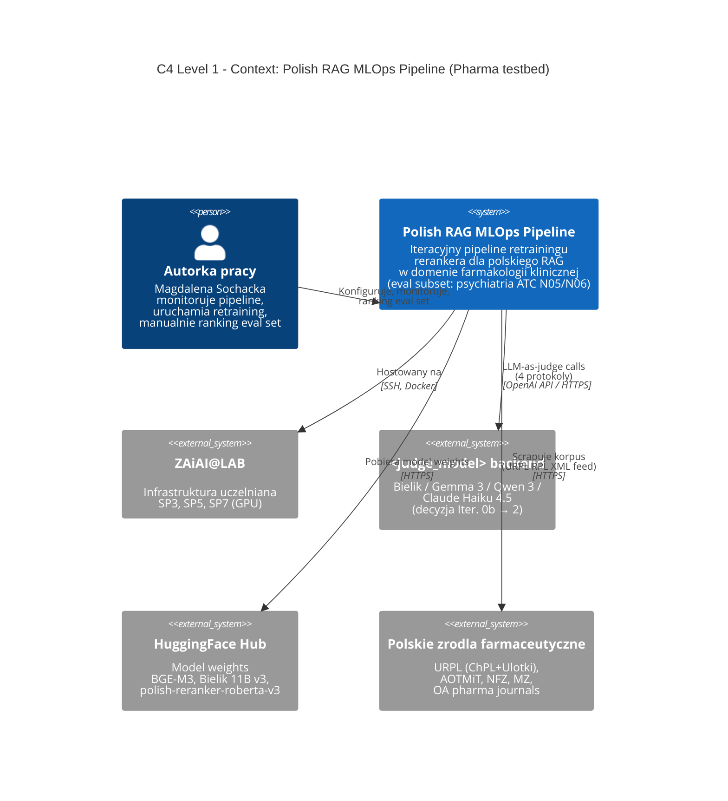
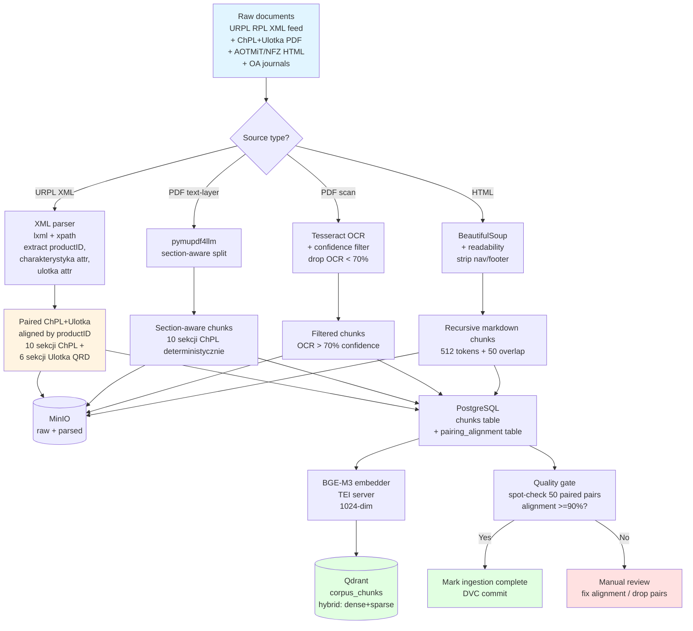
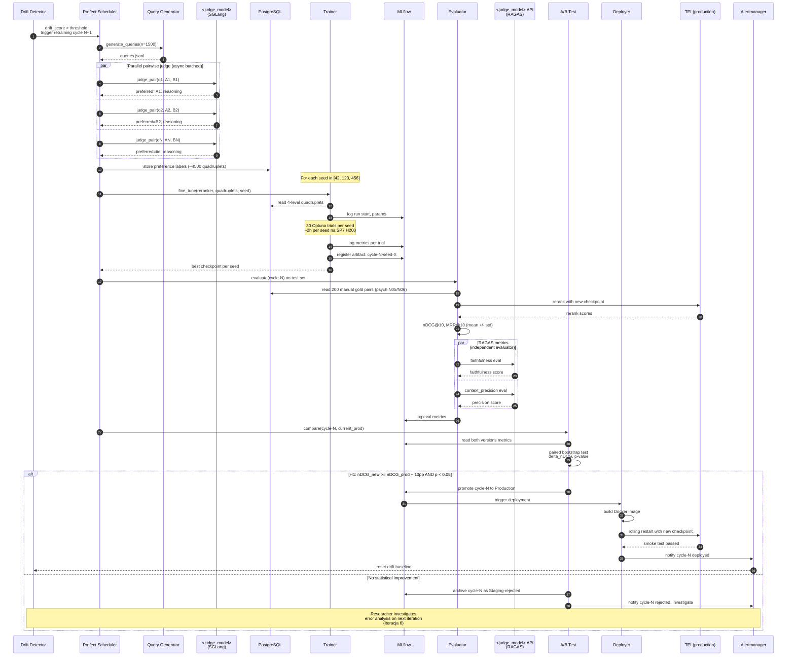

# R5. Architektura systemu (OUTLINE)

> **Status:** outline + diagrams + krótkie wprowadzenia per sekcja. Pełen draft sekcji 5.X prose w **Iteracji 7** (manual writing).
> **Autorka:** Magdalena Sochacka (s25508), PJATK
> **Wersja delty:** v3.1 (po DEC-001 + DEC-002, 2026-05-15)
> **Data outline:** 2026-05-16

> **Notka domenowa:** Pierwotny dokument źródłowy `03_diagrams_architektury.docx` (07.05.2026) używa nazewnictwa „psychiatria klinicznaˮ; w niniejszym outline zastosowano terminologię v3.1 (farmakologia kliniczna szeroka + psychiatryczny eval subset N05/N06). Mermaid sources są kopiowane z dokumentu źródłowego z punktowymi adaptacjami nazw (PTP/IPiN → URPL/AOTMiT/NFZ; vLLM → SGLang per `05_stack_techniczny.docx` update i pinning w `CLAUDE.md`). Każda zmiana wzgl. źródła zaznaczona inline komentarzem `%% ADAPTED v3.1`.

> **Notka stack:** Stack pinning w `main_project/CLAUDE.md` + `05_stack_techniczny.docx`. Diagramy używają **SGLang** dla LLM serving (Bielik + judge), **TEI** dla embedder + reranker, **Prefect 3** dla orkiestracji, **MLflow + Optuna** dla tracking, **LGTM stack** (Loki + Grafana + Tempo + Mimir/Prometheus) dla observability, **Evidently + Alibi Detect** dla drift, **LlamaIndex** dla RAG inference (z `ChatEngine` dla implicit multi-turn — II.13.10), **RAGAS** dla ewaluacji.

---

## 5.1 Założenia architektoniczne

Architektura pipeline'u podporządkowana jest sześciu założeniom projektowym, które dyktują wybór komponentów i topologię połączeń: (1) **open models** — wszystkie modele rdzenia (BGE-M3, polish-reranker-roberta-v3, Bielik 11B v3) na licencjach permisywnych Apache 2.0 / MIT / CC-BY (z świadomym wyjątkiem `<judge_model>` jeśli wybór padnie na CC-BY-NC PLLuM 12B-instruct lub komercyjne API, z explicite zapisanym fallbackiem do fully-open w R8 limitations); (2) **polish domain focus z polish-specific patterns rationale** (per `02b_konspekt_v3_updates.md` § II.2.1 post-update 2026-05-16) — komponenty dobrane z preferencją PL-native lub multilingual z udokumentowanym wsparciem polskiego; domain adaptation rerankera **adresuje polish-specific patterns wokół międzynarodowej terminologii** (fleksja DCI/INN przez 7 polskich przypadków, elastyczny szyk, regulatorowa frazeologia ChPL/Ulotek, polskie ramy refundacyjne *„ryczałt 30%"*, idiomatyka dosage instructions), **NIE** międzynarodową terminologię farmaceutyczną (DCI/ATC są międzynarodowe, znane przez BGE-M3 i polish-reranker base z pretraining); testbed farmakologii klinicznej z psychiatrycznym eval subsetem (ATC N05/N06) jako referencyjnym zbiorem manualnym; (3) **reproducibility** — pełen stack self-hosted, DVC dla danych, MLflow Model Registry dla modeli, pinning wersji w `pyproject.toml` (Python 3.13 + uv); (4) **drift-aware** — drift detection (Evidently + Alibi Detect) jest core component w rdzeniu pipeline'u, nie future work; (5) **ablation-ready** — pipeline zaprojektowany tak, by przełączniki ablacji A1-A4 (Defense scaffolding pkt 1) były pojedynczymi parametrami w Hydra config bez modyfikacji kodu; (6) **cross-register-capable** — explicite obsługa paired ChPL↔Ulotka jako pierwszej klasy ścieżki danych dla RQ5, nie post-hoc bolt-on.

Rozdział R5 prezentuje siedem diagramów na trzech poziomach abstrakcji (C4 Context → Container → Component) plus cztery diagramy operacyjne (ingestion flow, retraining loop z observability, cross-register pipeline, drift→retrain sequence). Pełna decompozycja kontenerów i komponentów technologicznych odsyła do `05_stack_techniczny.docx` (uzasadnienia per warstwa) oraz do `main_project/CLAUDE.md` (planowany layout `src/`).

**Cross-references:**
- R3 (Dane) — opis 6 strata farmakologicznych, paired ChPL↔Ulotka, źródła w `sources_catalog.md`
- R6 (Modele) — szczegóły reranker fine-tuningu, 4 protokoły LLM-as-judge, ablations A1-A4
- R7 (Wyniki) — metryki nDCG@10/MRR@10 per cykl, RQ5 cross-register results, drift simulation, RAGAS

---

## 5.2 Diagram 1 — C4 Context

Diagram poziomu Context (C4 Level 1) prezentuje system pipeline'u MLOps RAG jako pojedynczy „czarny boksˮ w otoczeniu czterech systemów zewnętrznych oraz autorki jako research operator. Cel diagramu: na pierwszej stronie rozdziału R5 ustanowić, że projekt nie jest izolowanym artefaktem badawczym, lecz wpisuje się w ekosystem polskich open-source narzędzi (HuggingFace dla wag modeli, URPL/AOTMiT/NFZ dla danych regulacyjnych) z jednym opcjonalnym płatnym touchpointem (Anthropic API dla Claude Haiku 4.5 jako kandydat `<judge_model>` i ewaluator RAGAS).



**Rysunek 5.1:** System pipeline'u MLOps RAG w otoczeniu zewnętrznym — perspektywa C4 Level 1 (Context).

**Legenda:** prostokąty zaokrąglone — systemy software'owe; postać — aktor ludzki; strzałki opisane semantyką relacji (NIE protokołem); `<judge_model>` to placeholder do final-decyzji w Iteracji 2 po head-to-head shortliście top-2 z Iteracji 0b.

**Decyzje architektoniczne wspierane przez ten diagram:**
- Pipeline pozostaje **w otoczeniu open-source** (HF Hub jako model registry zewnętrzny) — wzmacnia argument reprodukowalności w R1
- **Pojedynczy płatny touchpoint** (`<judge_model>` jeśli wybór padnie na Claude Haiku) jest izolowany do warstwy ewaluacji — generation pipeline pozostaje fully-open
- Dane wyłącznie z **urzędowych źródeł polskich** (Art. 4 ustawy o prawie autorskim) + OA journals — czysta license story dla R3

---

## 5.3 Diagram 2 — C4 Container

Diagram poziomu Container (C4 Level 2) otwiera „czarny boksˮ pipeline'u z Diagramu 1 i prezentuje wszystkie kontenery (services + databases) wraz z ich technologiami implementacyjnymi. To **centralna figura R5** — pokazuje, że Pipeline Orchestrator (Prefect 3) jest sercem stacku (wszystkie strzałki do/z niego), oraz że stack realizuje pełny cykl MLOps z observability LGTM stackiem i drift detection w core scope.

```mermaid
%% Source: 03_diagrams_architektury.docx Diagram 2
%% ADAPTED v3.1: vLLM → SGLang (per 05_stack_techniczny.docx update + main_project/CLAUDE.md);
%%               PLLuM judge → <judge_model> placeholder;
%%               dodano LlamaIndex jako RAG framework (X.1 wymiar równoległy)
C4Container
    title C4 Level 2 - Container: Polish RAG MLOps Pipeline

    Person(researcher, "Autorka", "Research operator")

    System_Boundary(rag_pipeline, "Polish RAG MLOps Pipeline") {
        Container(ui, "Gradio UI", "Python, Gradio 5", "3 zakladki: Demo, Compare, Annotate<br/>(II.5 Gradio framing)")
        Container(api, "API Layer", "Python, FastAPI", "Pipeline triggers, metrics export,<br/>LlamaIndex inference path")
        Container(orchestrator, "Pipeline Orchestrator", "Python, Prefect 3", "DAG-i: ingest, generate, judge, train,<br/>eval, drift, deploy, retraining_trigger")

        ContainerDb(postgres, "PostgreSQL", "PostgreSQL 16", "Metadane, chunks, eval pairs,<br/>quadruplets (4-level hard neg.),<br/>run logs, judge labels, drift metrics")
        ContainerDb(qdrant, "Qdrant", "Rust, Apache 2.0", "BGE-M3 embeddings, hybrid retrieval,<br/>drift_reference collection")
        ContainerDb(redis, "Redis Stack", "Redis + JSON + Search", "Semantic cache (GPTCache) +<br/>KV-prefix cache (LMCache)")
        ContainerDb(minio, "MinIO", "Go, S3-compatible", "Raw documents: URPL XML, PDF,<br/>AOTMiT, NFZ Zarzadzenia")

        Container(sglang_judge, "SGLang - <judge_model>", "Python, SGLang, GPU", "LLM-as-judge: 4 protokoly<br/>(pairwise, pointwise, faithfulness,<br/>cross-register pair scoring)")
        Container(sglang_bielik, "SGLang - Bielik", "Python, SGLang, GPU", "Bielik 11B v3 generation +<br/>synthetic query generator")
        Container(tei, "TEI", "Rust, HuggingFace", "BGE-M3 (frozen) + polish-reranker<br/>(fine-tunable, RDZEN)")

        Container(mlflow, "MLflow", "Python", "Tracking + Model Registry +<br/>A/B gating + Optuna integration")
        Container(langfuse, "Langfuse", "Node.js, self-hosted", "LLM-specific traces, prompt versioning")
        Container(otel, "OTel Collector", "Go, vendor-neutral", "Metrics, logs, traces routing")
        ContainerDb(prometheus, "Prometheus", "Go, TSDB", "Metrics, 15 days retention")
        ContainerDb(loki, "Loki", "Go, TSDB", "Log aggregation")
        ContainerDb(tempo, "Tempo", "Go, traces", "Distributed tracing")
        Container(grafana, "Grafana", "Go, UI", "Single pane of glass")
        Container(alertmanager, "Alertmanager", "Go", "User notifications<br/>(NIE automation)")

        Container(drift, "Drift Detector", "Python, Evidently + Alibi", "KS, MMD on BGE-M3 embeddings,<br/>simulated OOD experiment (RQ4)")
        Container(dvc, "DVC", "Python, CLI", "Dataset versioning,<br/>backend MinIO")
    }

    System_Ext(judge_api, "<judge_model> API (opt.)", "Anthropic / inny, jesli wybor")
    System_Ext(huggingface, "HuggingFace Hub", "Model weights")

    Rel(researcher, ui, "Uses", "HTTPS")
    Rel(researcher, grafana, "Monitors", "HTTPS")
    Rel(ui, api, "REST", "HTTPS")
    Rel(api, orchestrator, "Triggers", "Prefect SDK")
    Rel(api, qdrant, "Retrieves", "gRPC")
    Rel(api, redis, "Cache", "Redis protocol")
    Rel(api, sglang_bielik, "Generation", "OpenAI API")
    Rel(api, tei, "Embed + rerank", "REST")

    Rel(orchestrator, postgres, "Metadata", "psycopg")
    Rel(orchestrator, qdrant, "Indexes", "qdrant-client")
    Rel(orchestrator, sglang_judge, "Judge calls (4 protokoly)", "OpenAI API")
    Rel(orchestrator, sglang_bielik, "Faithfulness + queries", "OpenAI API")
    Rel(orchestrator, tei, "Train/inference", "REST")
    Rel(orchestrator, mlflow, "Logs + Optuna trials", "MLflow client")
    Rel(orchestrator, langfuse, "Traces", "Langfuse SDK")
    Rel(orchestrator, drift, "Drift checks", "Python")
    Rel(orchestrator, dvc, "Versioning", "CLI")
    Rel(orchestrator, judge_api, "Optional cross-check", "HTTPS")
    Rel(orchestrator, otel, "Telemetry", "OTLP")

    Rel(api, otel, "Telemetry", "OTLP")
    Rel(otel, prometheus, "Metrics", "remote write")
    Rel(otel, loki, "Logs", "Loki API")
    Rel(otel, tempo, "Traces", "OTLP")
    Rel(grafana, prometheus, "Queries", "PromQL")
    Rel(grafana, loki, "Queries", "LogQL")
    Rel(grafana, tempo, "Queries", "TraceQL")
    Rel(grafana, alertmanager, "Alerts", "REST")
    Rel(drift, alertmanager, "User notification", "REST")

    Rel(huggingface, sglang_judge, "Model weights", "HTTPS")
    Rel(huggingface, sglang_bielik, "Model weights", "HTTPS")
    Rel(huggingface, tei, "Model weights", "HTTPS")
    Rel(dvc, minio, "Data backend", "S3 API")
```



**Rysunek 5.2:** Pełen container view pipeline'u — 18 kontenerów (13 services + 5 databases) zorganizowanych wokół Prefect 3 jako orchestratora.

**Legenda:** kontenery zaznaczone jako `Container` (services) lub `ContainerDb` (databases); `System_Boundary` wyznacza granicę pipeline'u; `System_Ext` to zewnętrzne zależności; podpisy zawierają technologię + krótki opis roli.

**Decyzje architektoniczne wspierane przez ten diagram:**
- **Centralność Prefect 3** — wszystkie cross-cutting interakcje przechodzą przez orchestrator (uzasadnienie wyboru vs Airflow w `05_stack_techniczny.docx` § 3)
- **Separacja serving od training** — TEI (Rust, optimized inference) dla embedder + reranker, SGLang dla LLM workloads (Bielik + judge); training używa sentence-transformers + bezpośrednie torch loading
- **LGTM stack** (Loki + Grafana + Tempo + Prometheus) dla observability — single pane of glass z korelacją trace↔log↔metric per `trace_id`

---

## 5.4 Diagram 3 — C4 Component (reranker training loop wewnątrz Pipeline Orchestrator)

Diagram poziomu Component (C4 Level 3) otwiera kontener Pipeline Orchestrator z Diagramu 2 i prezentuje 11 wewnętrznych komponentów zaimplementowanych jako Prefect flows. Każdy komponent mapuje 1:1 na moduł Python w planowanym layoutie `main_project/src/` (zgodnie z `main_project/CLAUDE.md`): `src/ingest/`, `src/embed/`, `src/judge/`, `src/reranker/`, `src/eval/`, `src/drift/`, `src/pipeline/`. Diagram pokazuje, że każdy komponent ma jednoznaczne miejsce w kodzie i odpowiadającą mu sekcję w R6 (Modele) — brak komponentów implicit lub poza dokumentacją.

```mermaid
%% Source: 03_diagrams_architektury.docx Diagram 3
%% ADAPTED v3.1: PLLuM judge → <judge_model>; dodano cross-register variant w Judge Component;
%%               Trainer obsluguje 4-level quadruplets (II.4.6 hard negatives strategy)
C4Component
    title C4 Level 3 - Component: Pipeline Orchestrator (Prefect 3)

    Container_Boundary(orchestrator, "Pipeline Orchestrator (Prefect 3)") {
        Component(ingest, "Ingest Component", "Python, BeautifulSoup, pymupdf4llm, lxml", "URPL RPL XML scraping (paired ChPL+Ulotka),<br/>AOTMiT/NFZ HTML, OCR PDF, parser markdown")
        Component(indexer, "Indexer Component", "Python, BGE-M3 client", "Generuje embeddings, uploaduje do Qdrant<br/>(corpus_chunks + drift_reference)")
        Component(query_gen, "Query Generator", "Python, prompt template, Bielik client", "Synthetic queries z chunks (70/30 mix);<br/>cross-register query generator (RQ5)")
        Component(judge, "Judge Component", "Python, OpenAI client", "4 protokoly: pairwise, pointwise,<br/>faithfulness, cross-register pair scoring;<br/>prompt versioning (Langfuse)")
        Component(trainer, "Trainer Component", "Python, sentence-transformers, torch", "Fine-tune polish-reranker; preference loss<br/>na 4-level quadruplets (1 pos + 3 neg);<br/>Optuna 30 trials per cycle, 3 seeds")
        Component(evaluator, "Evaluator Component", "Python, RAGAS, scikit-learn, scipy.stats", "IR metrics (nDCG, MRR, accuracy@10),<br/>RAGAS (4 metryki),<br/>direction-stratified eval (RQ5)")
        Component(drift_comp, "Drift Detector", "Python, Evidently + Alibi Detect", "KS test per-dim, MMD aggregate,<br/>simulated OOD eksperyment (RQ4)")
        Component(registry_mgr, "Registry Manager", "Python, MLflow client", "Stage transitions:<br/>Staging -> Production -> Archived")
        Component(ab_test, "A/B Test Component", "Python, scipy.stats", "Compare new vs current,<br/>paired bootstrap, p-value")
        Component(deployer, "Deployer Component", "Python, Docker SDK", "Build image, push, TEI rolling restart,<br/>smoke test")
        Component(scheduler, "Scheduler", "Prefect deployments", "Cron schedules,<br/>conditional triggers (drift -> retrain)")
    }

    ComponentDb(postgres_ext, "PostgreSQL", "metadata, run logs, quadruplets")
    ComponentDb(qdrant_ext, "Qdrant", "embeddings + drift reference")
    ComponentDb(mlflow_ext, "MLflow", "experiments, registry")
    Component_Ext(sglang_judge_ext, "SGLang <judge_model>", "judge")
    Component_Ext(tei_ext, "TEI", "embedder + reranker")
    Component_Ext(judge_api_ext, "<judge_model> API (opt.)", "fallback / cross-check")
    Component_Ext(alertmgr_ext, "Alertmanager", "user notifications")

    Rel(ingest, postgres_ext, "Stores doc metadata + paired ChPL/Ulotka alignment")
    Rel(ingest, indexer, "Triggers indexing")
    Rel(indexer, qdrant_ext, "Stores vectors")
    Rel(indexer, postgres_ext, "Stores chunks")
    Rel(query_gen, judge, "Provides queries + pairs (incl. cross-register)")
    Rel(judge, sglang_judge_ext, "Judge calls (4 protokoly)")
    Rel(judge, judge_api_ext, "Optional cross-check")
    Rel(judge, postgres_ext, "Stores labels + reasoning")
    Rel(trainer, postgres_ext, "Reads quadruplets (1 pos + 3 neg)")
    Rel(trainer, tei_ext, "Saves checkpoint")
    Rel(trainer, mlflow_ext, "Logs metrics + Optuna trials")
    Rel(evaluator, mlflow_ext, "Logs eval (per direction dla RQ5)")
    Rel(evaluator, judge_api_ext, "RAGAS evaluator (opt.)")
    Rel(drift_comp, qdrant_ext, "Reads embedding distrib")
    Rel(drift_comp, alertmgr_ext, "Drift alert (user)")
    Rel(drift_comp, scheduler, "Triggers retrain (Prefect-native)")
    Rel(registry_mgr, mlflow_ext, "Stage transitions")
    Rel(ab_test, mlflow_ext, "Reads candidates")
    Rel(ab_test, registry_mgr, "Promote/reject")
    Rel(deployer, tei_ext, "Deploy reranker")
    Rel(scheduler, ingest, "Initial run")
    Rel(scheduler, query_gen, "Cycle start")
```



**Rysunek 5.3:** Wewnętrzna struktura Pipeline Orchestrator — 11 komponentów Prefect flow.

**Legenda:** `Component` to wewnętrzny komponent orchestratora; `ComponentDb` to baza zewnętrzna (poza boundary); `Component_Ext` to zewnętrzny system poza orchestratorem; podpisy zawierają technologię + opis roli.

**Decyzje architektoniczne wspierane przez ten diagram:**
- **Drift Detector ma podwójną rolę** — alert do user (przez Alertmanager) + trigger do scheduler (Prefect-native, wzorzec 2 z `05_stack_techniczny.docx` § 6.3) — eliminuje moving parts vs zewnętrzny webhook
- **Judge Component obsługuje 4 protokoły** w jednym module (z prompt versioning w Langfuse) — spójność architektoniczna z RQ5 cross-register (II.7.4 NEW protokół)
- **11 komponentów = 11 modułów Python** = mapowanie 1:1 na `src/` layout (`main_project/CLAUDE.md`); diagram potwierdza, że stack mapuje na kod bez „magicznychˮ glue layers

---

## 5.5 Diagram 4 — Pipeline ingestion (logical flow)

Diagram flow przedstawia liniowy przepływ danych od raw documents (URPL RPL XML feed, ChPL/Ulotka PDF, AOTMiT/NFZ HTML, OA journals) do indexed Qdrant collections. Cel: najprostszy diagram do zrozumienia dla osoby nieznającej MLOps — pokazuje, **co po czym się dzieje** w fazie ingestion + indexing, z explicitymi punktami decyzyjnymi (chunking strategy per source, paired alignment ChPL↔Ulotka via XML attribute).



**Rysunek 5.4:** Logical flow ingestion + indexing (4 source types → 4 chunking strategies → unified Qdrant).

**Legenda:** kolorystyka — niebieski (raw input), pomarańczowy (paired alignment, NEW dla RQ5), zielony (success states + storage), czerwony (rollback gate); rhomb — punkt decyzyjny.

**Decyzje architektoniczne wspierane przez ten diagram:**
- **Cztery chunking strategies** dobrane do source type (II.4.1 v3.1) — section-aware deterministic dla ChPL/Ulotka, recursive markdown dla journals
- **Paired alignment via XML attributes** (`charakterystyka` + `ulotka` na `<produktLeczniczy>` per schema discovery 2026-05-15) — deterministyczny, bez manualnej anotacji (DEC-002 § Uzasadnienie pkt 1)
- **Quality gate** ≥90% alignment z spot-check 50 par (II.4.3 + DEC-002 § Kill criteria) — gating przed DVC commit, eliminuje silent corruption korpusu

---

## 5.6 Diagram 5 — Pipeline retreningu z observability (flow)

Sercowy diagram R5: prezentuje pełen iteracyjny cykl retreningu (3 cykle z fresh queries i fresh judge labels w każdym), z A/B gating przez paired bootstrap statistical test, decoupling deploymentu od średniej poprawy (RQ1/H1 statistical gate), oraz drift monitoring jako odrębną pętlę. **Wbudowane hipotezy:** H1 (≥10pp po cyklu 1) → AB1 zielona; H3 (plateau po cyklu 2) → AB3 czerwona reject jako expected outcome. Diagram pokazuje **oba możliwe wyniki** dla cyklu 3 (deploy lub reject) zgodnie z naukową niepewnością.

```mermaid
%% Source: 03_diagrams_architektury.docx Diagram 5 (Iterative retraining cycle)
%% ADAPTED v3.1: PLLuM judge → <judge_model>; dodano hook do A4 ablation switch (ChPL-only vs ChPL+Ulotka)
flowchart LR
    subgraph Init[Initial state]
        BASE[Base reranker<br/>polish-reranker-roberta-v3<br/>off-the-shelf]
    end

    subgraph C1[Cykl 1 + Ablations A1-A4]
        Q1[Generate queries<br/>1500] --> J1[<judge_model><br/>4 protokoly]
        J1 --> T1[Train cycle-1<br/>3 seeds + Optuna<br/>4-level quadruplets]
        T1 --> E1[Eval cycle-1<br/>vs base + ablations<br/>A1: judge vs random<br/>A2: Bielik vs <judge_model><br/>A3: psych-only vs full<br/>A4: ChPL vs ChPL+Ulotka]
        E1 --> AB1{A/B gate<br/>nDCG +10pp<br/>p < 0.05?}
        AB1 -->|H1: pass| D1[Deploy cycle-1]
    end

    subgraph C2[Cykl 2]
        Q2[Fresh queries<br/>+ drift queries] --> J2[Judge cycle-2]
        J2 --> T2[Train cycle-2<br/>3 seeds]
        T2 --> E2[Eval vs cycle-1]
        E2 --> AB2{Wins?}
        AB2 -->|H3: still gain| D2[Deploy cycle-2]
    end

    subgraph C3[Cykl 3]
        Q3[Fresh queries] --> J3[Judge cycle-3]
        J3 --> T3[Train cycle-3<br/>3 seeds]
        T3 --> E3[Eval vs cycle-2]
        E3 --> AB3{delta > 2pp<br/>p < 0.05?}
        AB3 -->|H3: plateau<br/>EXPECTED| D3[Reject cycle-3<br/>stop iteration]
        AB3 -->|Unlikely: still wins| D3X[Deploy cycle-3]
    end

    subgraph Drift[Drift monitoring + Observability]
        DM[Embedding drift<br/>KS, MMD<br/>Evidently + Alibi] --> DT{Drift<br/>detected?}
        DT -->|Yes, simulated RQ4| RT[Trigger<br/>retraining]
        DT -->|No| CS[Continue serving]

        OBS[OpenTelemetry traces<br/>+ Langfuse LLM traces<br/>+ Prometheus metrics<br/>+ MLflow runs]
    end

    BASE --> Q1
    D1 --> Q2
    D2 --> Q3
    D3 --> DM
    D3X --> DM
    RT -.->|in production<br/>not in this thesis| Q1

    OBS -.async.-> J1
    OBS -.async.-> T1
    OBS -.async.-> J2
    OBS -.async.-> T2
    OBS -.async.-> J3
    OBS -.async.-> T3
    OBS -.async.-> DM

    style BASE fill:#cccccc
    style D1 fill:#90EE90
    style D2 fill:#90EE90
    style D3 fill:#FFB347
    style D3X fill:#90EE90
    style RT fill:#FF6B6B
    style OBS fill:#dbe5ff
```



**Rysunek 5.5:** Pełen cykl iteracyjnego retreningu z A/B gating, ablations A1-A4 w cyklu 1 i drift monitoring jako odrębną pętlą.

**Legenda:** kolorystyka — szary (initial state), zielony (deploy), pomarańczowy (expected reject per H3), czerwony (drift trigger w produkcji — poza scope tej pracy, simulated only), niebieski (observability cross-cutting); strzałki przerywane = async (observability nie blokuje critical path); rhomb = decision gate.

**Decyzje architektoniczne wspierane przez ten diagram:**
- **A/B gate jako statistical, nie average-based** — paired bootstrap z `p < 0.05` zamiast prostego średnia +10pp (eliminuje deployment na statystycznie nieistotnej poprawie, defensywne pod Kojałowicza)
- **Continuous retraining w produkcji = future work** (przerywana czerwona strzałka `RT -.-> Q1`) — explicite zaznaczone że scope obejmuje **simulated** drift trigger, nie live traffic (II.13.4)
- **Observability cross-cutting** (async) — OpenTelemetry + Langfuse + Prometheus + MLflow nie blokują critical path; production-grade pattern

### 5.6.1 Ablation architecture

Ablations A1-A4 (Defense scaffolding pkt 1 z `thesis_elements/CLAUDE.md`) są zaimplementowane jako **przełączniki w Hydra config** wewnątrz Trainer Component, bez modyfikacji kodu. Każdy ablation = osobny MLflow run z tagiem `ablation=A{1..4}`, raportowany jako tabela w R7 obok głównego Cyklu 1. Cztery przełączniki: **A1** `judge.source={pllum_pairwise, random}` — test czy judge signal ma wartość vs random labels; **A2** `judge.model={<judge_model>, bielik_11b_v3}` — kontrola czy wybór sędziego jest robust; **A3** `corpus.scope={full_pharma, psych_only_N05_N06}` — test czy szeroki korpus daje przewagę vs wąski (psych-only) trening; **A4** `corpus.register={chpl_only, chpl_plus_ulotka}` — RQ5-specyficzny ablation (cross-register lift). Wszystkie cztery wykonywane w **Iteracji 2** (II.16) — single-cycle scope, każdy z 3 seeds.

---

## 5.7 Diagram 6 — Cross-register pipeline (NEW dla RQ5)

Diagram cross-register pipeline (NOWY w v3.1, brak odpowiednika w `03_diagrams_architektury.docx`) prezentuje przepływ danych specyficzny dla RQ5: **paired ChPL↔Ulotka via XML attributes** (`charakterystyka` + `ulotka` na `<produktLeczniczy>` w URPL RPL XML feed) z deterministycznym alignment przez `productID`, oraz cztery directions ewaluacyjne (lay→pro, pro→lay, lay→lay same-register baseline, pro→pro same-register baseline). URL-e dokumentów są ekstrahowane z XML metadata (NIE template'owane). Diagram pokazuje, że RQ5 **nie wymaga osobnego pipeline'u trenowania** — używa tego samego rerankera, tego samego LLM-judge (z dodatkowym 4. protokołem cross-register pair scoring per II.7.4), i osobnego eval setu (1800 par, 900 lay→pro + 900 pro→lay).

> 🟡 **Verify via /diagram skill** — diagram poniżej jest plausible Mermaid skeleton, NIE skopiowany ze źródła. Iteracja 7 powinna uruchomić `/diagram` skill (z `validate_and_render_mermaid_diagram` MCP) dla weryfikacji renderowania + ewentualnego refactoringu układu.

```mermaid
%% NEW v3.1 — brak odpowiednika w 03_diagrams_architektury.docx
%% Pipeline-only (training + eval); ingestion ChPL+Ulotka pokazane w Diagramie 4 (5.5)
flowchart TD
    subgraph Source[Source: URPL RPL XML feed]
        XML[URPL RPL XML<br/>productID + charakterystyka attr<br/>+ ulotka attr per produkt]
    end

    subgraph Align[Deterministic alignment]
        XML --> P[Pair extractor<br/>900 par leków<br/>ATC N05/N06 over-rep]
        P --> CHPL[ChPL chunks<br/>10 sekcji deterministycznie]
        P --> ULO[Ulotka chunks<br/>6 sekcji QRD]
        CHPL -.-|productID join|.- ULO
    end

    subgraph Train[Training corpus assembly]
        CHPL --> TC[Training corpus<br/>ChPL + Ulotka<br/>preference quadruplets<br/>incl. L4 cross-register negatives 5%]
        ULO --> TC
        TC --> RR[Reranker fine-tune<br/>polish-reranker-roberta-v3<br/>3 seeds + Optuna]
    end

    subgraph Eval[Cross-register evaluation - 4 directions]
        TC --> Q_lay[Lay queries<br/>z Ulotki sekcji]
        TC --> Q_pro[Pro queries<br/>z ChPL sekcji]

        Q_lay --> D_lp[lay -> pro<br/>900 par<br/>gold = ChPL same drug]
        Q_lay --> D_ll[lay -> lay<br/>same-register baseline]
        Q_pro --> D_pl[pro -> lay<br/>900 par<br/>gold = Ulotka same drug]
        Q_pro --> D_pp[pro -> pro<br/>same-register baseline]

        D_lp --> M[Metrics:<br/>accuracy@10 per direction<br/>MRR@10 per direction<br/>Direction asymmetry gap delta_dir<br/>Same-vs-cross gap]
        D_ll --> M
        D_pl --> M
        D_pp --> M

        RR --> D_lp
        RR --> D_ll
        RR --> D_pl
        RR --> D_pp
    end

    subgraph Judge[<judge_model> 4. protokol]
        J4[Cross-register pair scoring<br/>2 wymiary:<br/>semantic_match_quality 0-5<br/>register_appropriateness 0-5]
    end

    M --> AB4{A4 ablation:<br/>ChPL-only vs<br/>ChPL+Ulotka}
    AB4 --> H5{H5 answered?<br/>accuracy@10 >=70%<br/>gap <=5pp}

    D_lp -.->|sample 50/200 manual spot-check|.- J4
    D_pl -.->|sample 50/200 manual spot-check|.- J4

    style XML fill:#e1f5ff
    style P fill:#fff4e1
    style RR fill:#ffd700
    style M fill:#e1ffe1
    style H5 fill:#90EE90
    style J4 fill:#dbe5ff
```

**Rysunek 5.6:** Cross-register pipeline z paired ChPL↔Ulotka — od URPL XML feed do RQ5/H5 evaluation w czterech directions.

**Legenda:** kolorystyka — niebieski (source), pomarańczowy (alignment), żółty (training core), zielony (metrics + final hipoteza), jasnoniebieski (judge); strzałki kropkowane = manual spot-check 50 par (5%); linia kropkowana z `productID join` = deterministyczny alignment.

**Decyzje architektoniczne wspierane przez ten diagram:**
- **Cztery directions evaluacyjne** (lay→pro, pro→lay, lay→lay, pro→pro) — asymmetric difficulty (DEC-002 + II.3.3 setup ewaluacyjny), reportowane osobno + jako aggregate
- **Direction asymmetry gap** `Δ_dir = |MRR(lay→pro) − MRR(pro→lay)|` — measure czy reranker jest stronniczy w kierunku jednego register (II.3.3 v3.1)
- **A4 ablation** explicite porównuje ChPL-only training vs ChPL+Ulotka training na **tym samym** cross-register test set — izolacja efektu paired training data (DEC-002 § Konsekwencje)
- **Cross-register pair scoring jako 4. protokół judge'a** (II.7.4) — rozdziela `semantic_match_quality` od `register_appropriateness` dla diagnostyki czy reranker miss-rankuje semantycznie czy stylistycznie

---

## 5.8 Diagram 7 — Drift detection trigger logic (sequence)

Diagram sekwencyjny prezentuje **time-ordered interactions** w pełnym cyklu drift→retraining→A/B gating→deployment z perspektywy 13 aktorów (Drift Detector + Prefect Scheduler + Query Generator + `<judge_model>` + PostgreSQL + Trainer + MLflow + Evaluator + RAGAS evaluator + A/B Test + Deployer + TEI production + Alertmanager). Cel: najgłębszy deep dive dla recenzenta (Kojałowicz), który chce zrozumieć dokładny mechanizm event ordering i statistical gating, plus pokazanie że async LLM calls (parallel block) są kluczowe dla productivity (1500 par sekwencyjnie ~120 min vs async batched ~5-10 min).



**Rysunek 5.7:** Sequence — retraining cycle z drift trigger, async judge, A/B gating, deployment lub archiwizacja.

**Legenda:** numerowane interakcje (autonumber); `par` block = parallel async LLM calls; `alt` block = decision gate z deploymentem lub archiwizacją; strzałki ciągłe = synchronous request, strzałki kropkowane (`-->>`) = response; `Note over` = adnotacje grupy aktorów.

**Decyzje architektoniczne wspierane przez ten diagram:**
- **3 seeds + paired bootstrap** — statystyczna stabilność wyników, NIE deployment na pojedynczym uruchomieniu
- **Statistical gate H1 jako warunkowy alt block** — deployment NIE automatic na średnie, wymaga `p < 0.05` (defensywne pod Kojałowicza)
- **RAGAS przez `<judge_model>` API jako niezależny evaluator** — eliminuje circular reasoning (judge_primary trenuje labels → judge_external waliduje faithfulness)
- **Alertmanager → Drift Detector reset** (krok końcowy w alt-success) — zamyka pętlę, eliminuje stale baseline po deploymencie

---

## TODO dla Iteracji 7 (manual writing)

- [ ] Rozszerzyć każdą sekcję 5.X do pełnej prose (target ~1000-1500 słów per sekcja diagramowa, 5.1 założenia ~600 słów, 5.6.1 ablations ~400 słów)
- [ ] Dodać cytacje techniczne do prose:
  - Prefect 3 — official docs / Prefect blog (NIE academic paper, flag jako tool reference)
  - MLflow — Zaharia et al. 2018 *Accelerating the Machine Learning Lifecycle with MLflow* 🟡 Verify via citation-checker (rok + venue)
  - Optuna — Akiba et al. 2019 *Optuna: A Next-generation Hyperparameter Optimization Framework* (KDD 2019) 🟡 Verify
  - Evidently — tool reference (NIE academic paper)
  - Alibi Detect — Klaise et al. 2020 *Monitoring and Explainability of Models in Production* (ICML 2020 ML Production workshop) 🟡 Verify
  - LlamaIndex — tool reference + ChatEngine builtin docs
  - RAGAS — Es et al. 2024 *RAGAS: Automated Evaluation of Retrieval Augmented Generation* (EACL 2024) 🟡 Verify
  - SGLang — Zheng et al. 2024 *SGLang: Efficient Execution of Structured Language Model Programs* 🟡 Verify (NeurIPS 2024 vs arXiv)
  - TEI — HuggingFace tool reference
  - C4 model — Brown 2018 *The C4 model for visualising software architecture* (book / online; NIE peer-reviewed paper) — flag jako reference book
  - DPR (dla 4-level hard negatives) — Karpukhin et al. 2020 *Dense Passage Retrieval for Open-Domain Question Answering* (EMNLP 2020) — już cytowane w II.4.6
- [ ] Cross-references do R6 (modele) i R7 (wyniki) — explicite linki "patrz R6.X" / "patrz R7.X"
- [ ] Rysunek 5.X numbering — finalne numerowanie po decyzji o final liczbie diagramów (5 z 7 obowiązkowych w R5; **rekomendacja**: Diagram 6 (Runtime inference flow) z `03_diagrams_architektury.docx` przeniesiony do **R5 sekcja bonus 5.9** lub **R6** jako runtime-side companion do training-side architektury; Diagram cache-layers może iść do R7 jako bonus observability subsection)
- [ ] Uruchomić `/diagram` skill dla Diagramu 6 (Cross-register, NEW) — weryfikacja renderowania Mermaid + ewentualny refactoring layoutu (currently TBD plausible skeleton)
- [ ] Zweryfikować, czy `judge_model` po Iteracji 2 → final winner (Bielik 11B v3 / Gemma 3 27B / Qwen 3 32B / Claude Haiku 4.5) — wszędzie placeholder zamienić na wybrany model
- [ ] Dodać legendę kolorystyki spójną przez wszystkie diagramy flow (Diagramy 4, 5, 6) — currently ad-hoc per diagram
- [ ] Sekcja 5.9 (opcjonalna): "Mapowanie diagramów na rozdziały" — tabelka z `03_diagrams_architektury.docx` § Mapowanie (wskazówka: Rozdz. 5 ma 5 z 7 figur)
- [ ] Sekcja 5.X (opcjonalna, jeśli starczy miejsca): "Granice scope architektury" — explicite zaznaczyć co NIE jest pokazane (e.g. brak end-user clinical UI, brak real-time drift na live traffic — II.13.3-4)
- [ ] Sekcja 5.X obowiązkowa (per `02b_konspekt_v3_updates.md` II.5 Gradio framing): **User-facing demo** z Figurą 5.8 (Gradio UI mock-up screenshot) + disclaimer text verbatim quote ("System NIE udziela porad medycznych ani farmaceutycznych...")
