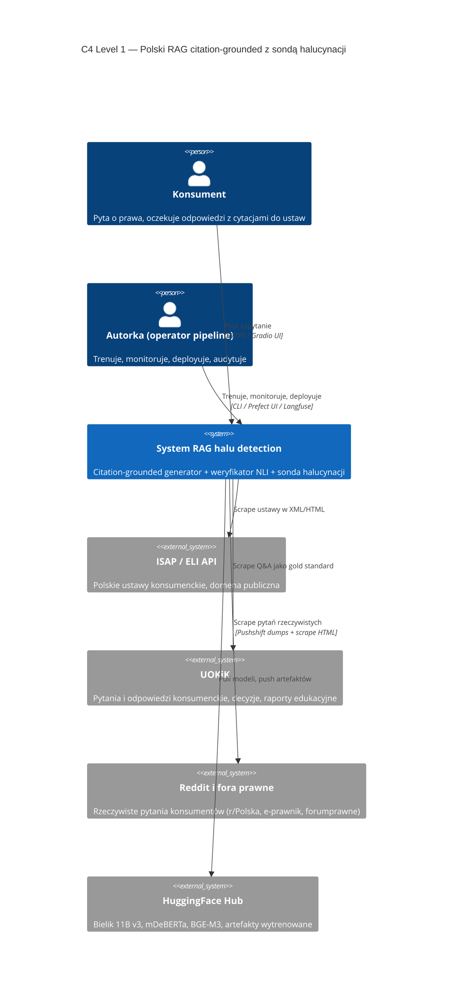
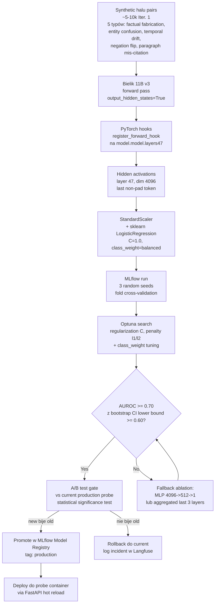
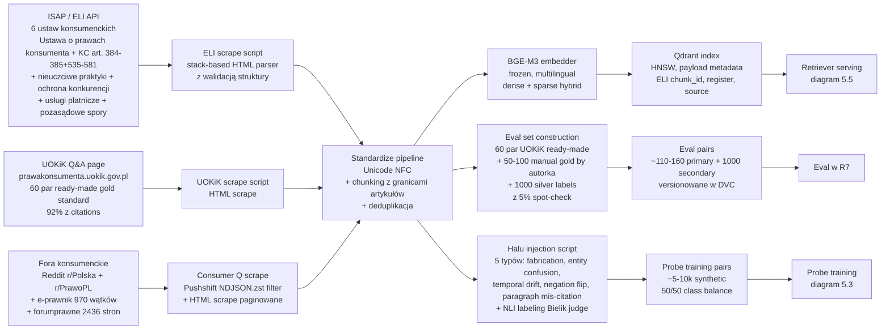
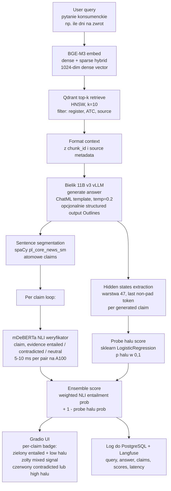
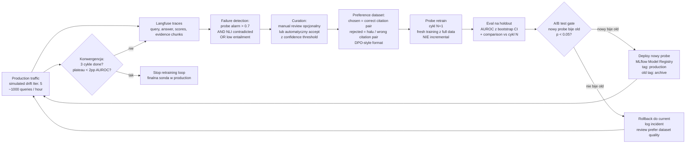
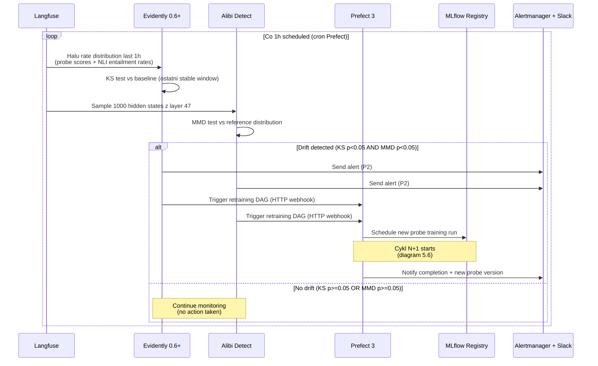

# R5. Architektura systemu

**Status:** SKELETON v3.2 (post-DEC-003, Iteracja 0b, 2026-05-16)
**Type:** szkielet z siedmioma diagramami *Mermaid* w pełni renderowanymi plus zwięzłe sekcje wprowadzające. Pełna prose rozdziału powstanie w Iteracji 7 (build-first-finalize-last). Cel: gotowy materiał dla skill `/diagram` (walidacja Mermaid przez MCP) oraz solidna podstawa do rozwinięcia w finalnym tekście pracy.
**Length target (skeleton):** 4000-5000 słów. **Length target (Iter. 7 final prose):** 8000-12000 słów (rozdział centralny).

---

## 5.0 Wprowadzenie do rozdziału

Niniejszy rozdział stanowi centralny komponent inżynierski pracy. Opisuje architekturę polskojęzycznego systemu *retrieval-augmented generation* (RAG) z dwoma komponentami nadzorującymi jakość wyjścia: programatycznym weryfikatorem cytacji opartym o *natural language inference* (NLI) oraz sondą halucynacji działającą na ukrytych stanach modelu generującego. Architektura jest zaprojektowana jako pełny pipeline *MLOps* obejmujący ingestię, indeksację, wnioskowanie, monitorowanie produkcyjne oraz ciągłe dotrenowywanie komponentów na podstawie sygnałów *observability*. Studium przypadku dotyczy polskich praw konsumenta jako domeny krytycznej.

Rozdział jest zorganizowany wokół siedmiu rysunków architektury wykonanych w notacji *Mermaid* (kompatybilność z *Markdown* PJATK oraz eksportem do *DOCX* poprzez renderery *Mermaid CLI*). Trzy pierwsze diagramy realizują metodologię *C4 model* C. Browna na poziomach *Context*, *Container*, *Component*. Cztery kolejne diagramy ukazują przepływy procesowe: ingestię korpusu, inferencję z weryfikacją cytacji per *claim*, pętlę ciągłego dotrenowywania oraz logikę wyzwalania retreningu przez wykrycie dryftu.

---

## 5.1 Założenia architektoniczne

Architektura systemu spełnia sześć założeń projektowych, wynikających z wymagań domeny krytycznej oraz konstrukcji pracy inżynierskiej. Założenia stanowią *invariant* projektowy — każdy komponent dyskutowany w kolejnych sekcjach jest motywowany odniesieniem do co najmniej jednego z nich. Sekcja 5.1 jest celowo krótka — pełne uzasadnienia stacku znajdują się w rozdziale R6 *Modele i komponenty*.

1. **Priorytet modeli otwartych.** Cały stos modeli wykorzystuje licencje permissywne (*Apache 2.0*, *MIT*, *CC-BY*). Generator *Bielik 11B v3* (*Apache 2.0*), weryfikator NLI *mDeBERTa-v3-base-xnli-multilingual-nli-2mil7* (*MIT*), embedder *BGE-M3* (*MIT*). Założenie eliminuje *vendor lock-in*, umożliwia publiczne udostępnienie trzech artefaktów *HuggingFace* (dataset *Polish CitationBench*, sonda halucynacji, weryfikator cytacji) oraz zapewnia zgodność z domeną legalną, gdzie *closed weights* utrudniają audyt.

2. **Polish-first.** Generator *Bielik 11B v3* trenowany natywnie na korpusie 292 miliardów tokenów polskich plus *SlimPajama* angielski [^bielik-tech-report]. Tokenizer *APT4* osiąga *fertility* 1.62 tokena na słowo polskie wobec 3.22 w wanilowym *Mistral* [^apt4]. Weryfikator NLI ma polski jako jeden z dwudziestu siedmiu języków treningowych [^mdeberta-card]. Założenie wynika z luki w landscape — *Mu-SHROOM 2025 SemEval Task 3* pominął polski [^mu-shroom-2025]; brak polish-specific equivalentów *Lynx* lub *HHEM*.

3. **Reprodukowalność.** Wszystkie artefakty wersjonowane są poprzez *DVC* (datasety, snapshoty korpusu), *MLflow Model Registry* (modele, sondy, wagi weryfikatora) oraz `pyproject.toml` z `uv.lock` (pinned zależności Python 3.13). Każdy *experiment run* w *MLflow* zawiera deterministyczny *seed*, hash datasetu, hash kodu (*git commit SHA*) oraz pełny *artifact bundle*.

4. **Observability-driven.** Każda decyzja architektoniczna jest motywowana sygnałem obserwowalnym w *Langfuse* (LLM traces), *OpenTelemetry* (rozproszone tracing) oraz *LGTM stack* (*Loki* dla logów, *Grafana* dla wizualizacji, *Tempo* dla traces, *Mimir* dla metryk). Sygnały zbierane są nie tylko dla diagnostyki — stanowią także *input* dla pętli ciągłego dotrenowywania (sekcja 5.7).

5. **Citation-grounded.** Generator nie odpowiada bez przypisania każdej tezy do konkretnego fragmentu dokumentu źródłowego z systemu *ISAP* w strukturze *ELI* (*European Legislation Identifier*). Architektura *ELI* zapewnia deterministyczne mapowanie *artykuł X ustęp Y punkt Z* na chunk, co czyni *citation grounding* metryką precyzyjną i powtarzalną.

6. **Hidden-states probing.** Detekcja halucynacji opiera się na linearnej sondzie trenowanej na ukrytych aktywacjach generatora na warstwie 47 z 50 (= ⌊0.95 × 50⌋ zgodnie z heurystyką Balcells i wsp. 2025 [^balcells-2025]). Technika reprezentuje *frontier* metodologiczny 2025-2026 [^dubanowska-2025] [^liang-wang-2025]; pierwsze publicznie udokumentowane zastosowanie do polskiego LLM stanowi kontrybucję metodologiczną pracy (RQ1, hipoteza H1).

---

## 5.2 Diagram 1 — kontekst systemu w notacji C4

Pierwszy diagram (rysunek 5.1) przedstawia system w jego otoczeniu zgodnie z poziomem *Context* metodologii *C4 model*. Identyfikuje aktorów ludzkich (konsumenta końcowego oraz autorkę-operatora), system jako całość oraz cztery zewnętrzne systemy źródłowe: *ISAP/ELI API* dla aktów prawnych, portal *UOKiK* dla par pytanie-odpowiedź, fora konsumenckie dla rzeczywistych pytań oraz *HuggingFace Hub* dla modeli i artefaktów. Diagram celowo abstrahuje od szczegółów wewnętrznych — pełna dekompozycja kontenerów następuje w rysunku 5.2.

**Rysunek 5.1.** *C4 Context* — system polskiego RAG z citation grounding i detekcją halucynacji w otoczeniu zewnętrznych źródeł danych oraz dwóch klas aktorów. Źródło: opracowanie własne.

**Legenda elementów:** *Person* — aktor ludzki (kolor niebieski w renderze *C4*); *System* — komponent w zakresie pracy (granatowy); *System_Ext* — system zewnętrzny poza kontrolą autorki (szary); *Rel* — relacja kierunkowa z opisem interakcji. Strzałki wychodzą od inicjatora.

---

## 5.3 Diagram 2 — dekompozycja kontenerów w notacji C4

Drugi diagram (rysunek 5.2) przedstawia poziom *Container* metodologii *C4 model*. Granica `System_Boundary` obejmuje wszystkie komponenty będące przedmiotem implementacji. Dekompozycja na jedenaście kontenerów odpowiada granicom procesów wdrożeniowych (każdy kontener jest osobnym serwisem *Docker* lub procesem *Python*). Stosem persystencji są trzy bazy danych specjalizowane: *Qdrant* dla wektorów, *PostgreSQL* dla metadanych oraz *DVC + MinIO* dla wersjonowania korpusu.

```mermaid
C4Container
    title C4 Level 2 — Kontenery systemu RAG halu detection
    Person(user, "Konsument", "Gradio UI")
    System_Boundary(rag, "System RAG halu detection") {
        Container(api, "FastAPI gateway", "Python 3.13, FastAPI", "REST endpoints, mount Gradio, autentykacja")
        Container(ui, "Gradio UI (3 zakładki)", "Python 3.13, Gradio", "Chat / Inspect (probe scores) / Compare (warianty)")
        Container(retriever, "Retriever", "BGE-M3 frozen, Qdrant client", "Embedding zapytania, dense retrieval top-k")
        Container(generator, "Generator", "Bielik 11B v3, vLLM 0.15+", "Polskie odpowiedzi z ChatML, structured output via Outlines")
        Container(probe, "Halu Probe", "sklearn LogisticRegression, PyTorch hooks", "Ekstrakcja hidden states warstwa 47, score halucynacji")
        Container(verifier, "Citation Verifier", "mDeBERTa-v3 NLI, Tier 1", "Per-claim entailed / contradicted / neutral")
        Container(orchestrator, "Prefect 3", "Async DAG, Prefect Cloud lub OSS", "Ingestion, training, retraining flows")
        Container(tracking, "MLflow + Optuna", "MLflow Tracking + Model Registry", "Experiments, A/B gating, model versioning")
        Container(observability, "Langfuse + LGTM", "Langfuse, OpenTelemetry, Grafana, Loki, Tempo, Mimir", "Production traces, dashboards, alerty")
        Container(drift, "Drift detection", "Evidently 0.6+, Alibi Detect", "KS test halu rate, MMD test hidden activations")
        ContainerDb(qdrant, "Qdrant", "Vector database, Rust", "Embeddings ELI chunks + UOKiK + pytania")
        ContainerDb(postgres, "PostgreSQL", "Relacyjna baza, JSONB", "Eval set, run metadata, citations log")
        ContainerDb(dvc, "DVC + MinIO", "Object storage, S3-compatible", "Snapshoty korpusu, versioned datasets")
    }
    Rel(user, ui, "Wypełnia query", "HTTPS")
    Rel(ui, api, "REST call", "JSON over HTTPS")
    Rel(api, retriever, "Embed + retrieve")
    Rel(retriever, qdrant, "Wektorowe wyszukiwanie top-k")
    Rel(api, generator, "Generate z retrieved context")
    Rel(generator, probe, "Hidden states warstwa 47")
    Rel(api, verifier, "Per-claim NLI")
    Rel(verifier, qdrant, "Pull evidence chunks")
    Rel(api, postgres, "Log query, citations, scores")
    Rel(orchestrator, generator, "Trigger retraining")
    Rel(orchestrator, probe, "Trigger probe retraining")
    Rel(observability, api, "Trace collection")
    Rel(observability, generator, "LLM traces via Langfuse")
    Rel(drift, observability, "Read halu rate distributions")
    Rel(drift, orchestrator, "Trigger retraining DAG")
    Rel(tracking, dvc, "Pull versioned datasets")
    Rel(tracking, qdrant, "Read embeddings dla eval")
```

**Rysunek 5.2.** *C4 Container* — dekompozycja systemu na jedenaście kontenerów aplikacyjnych oraz trzy bazy persystencji. Źródło: opracowanie własne.

**Komentarz architektoniczny:** podział na *retriever*, *generator*, *probe*, *verifier* jako osobne kontenery wynika z różnych profili sprzętowych — *generator* wymaga GPU klasy *H200* lub *A100 80GB* (*Bielik 11B v3* zajmuje około 22 GB w precyzji *bf16*, mniej w *FP8 Dynamic*), *probe* działa na CPU (predykcja *sklearn* na pojedynczym wektorze 4096-wymiarowym), *verifier* mieści się na GPU klasy *RTX 3060* (*mDeBERTa* 300M parametrów). *Retriever* korzysta z *TEI* (*Text Embeddings Inference*) napisanego w *Rust* — dwu- do trzykrotnie szybszego niż *sentence-transformers* w Pythonie.

---

## 5.4 Diagram 3 — pętla treningowa sondy halucynacji w notacji C4 Component

Trzeci diagram (rysunek 5.3) przedstawia poziom *Component* metodologii *C4* z fokusem na pętlę treningową sondy halucynacji. Diagram odpowiada na pytanie projektowe: w jaki sposób z surowych aktywacji modelu *Bielik 11B v3* powstaje produkcyjny artefakt sondy oraz jakie *quality gates* przechodzi przed deploymentem. Kluczowe elementy: ekstrakcja aktywacji przez *PyTorch hooks*, trening linearnej regresji logistycznej w *sklearn*, *bootstrap confidence interval* 95% z 1000 *resamples* (zgodnie z krytyką *Mirage of Halu Detection* [^mirage-2025]), *A/B test gate* w *MLflow Model Registry*.

**Rysunek 5.3.** *C4 Component* — pętla treningowa sondy halucynacji od surowych aktywacji do produkcyjnego artefaktu z bramkami jakościowymi. Źródło: opracowanie własne.

**Decyzje projektowe (pełne uzasadnienia w R6 sekcja 6.2):**
- Wybór warstwy 47 zgodny z heurystyką *near-output* Balcells i wsp. 2025 [^balcells-2025] dla modelu o 50 warstwach (= ⌊0.95 × 50⌋). Alternatywa Bayesian layer search (Liang & Wang 2025 [^liang-wang-2025]) odłożona jako *future work* (czasochłonność niewspółmierna dla pilota).
- Architektura linearna *primary* — regresja logistyczna na pojedynczej warstwie *sklearn* — minimalizuje *overfitting* przy ograniczonym datasecie (~200 ręcznie anotowanych par plus syntetyczne) per Dubanowska i wsp. 2025 [^dubanowska-2025].
- *Fallback* MLP 4096→512→1 uruchamiany dopiero gdy linear nie spełnia progu, zgodnie z zaleceniem Liang & Wang 2025 (+270% precision na granicy decyzji dla MLP wobec linear).
- *PyTorch hooks* + HF `output_hidden_states=True` jako narzędzie ekstrakcji — *transformer-lens* nie obsługuje natywnie 50-warstwowego *upscaled Mistral* (lista *Model Properties* zawiera tylko *Mistral 7B 32L*); *nnsight* daje *overhead* deferred execution niewspółmierne dla pilota.
- Reference implementation: fork `obalcells/hallucination_probes` (*Apache-2.0*, reported AUROC 0.87-0.90 na *English Mistral Small 24B*) z adaptacją głównie konfiguracyjną (edycja `layer_idx` w *YAML* config).

---

## 5.5 Diagram 4 — przepływ ingestii korpusu

Czwarty diagram (rysunek 5.4) przedstawia przepływ ingestii korpusu. Architektura opiera się na trzech równoległych ścieżkach scrape'owania (*ISAP/ELI*, *UOKiK Q&A*, fora konsumenckie) zbiegających się w jednolitym pipeline normalizacji (*Unicode NFC*, *chunking* z granicami artykułów ustaw, deduplikacja). Następnie korpus rozgałęzia się w trzy zastosowania: indeksację wektorową *Qdrant* (poprzez embedding *BGE-M3*), budowę eval setu (60 par *UOKiK* gotowych plus 50-100 ręcznie anotowanych przez autorkę) oraz syntetyczną iniekcję halucynacji (5 typów, ~5-10 tysięcy par dla treningu sondy).

**Rysunek 5.4.** Przepływ ingestii korpusu — od trzech równoległych źródeł do trzech zastosowań w pipeline. Źródło: opracowanie własne.

**Decyzje projektowe (pełne uzasadnienia w R3 sekcja 3.2):**
- Trzy równoległe scrape'y dla niezależności *rate limit* oraz różnych mechanizmów dostępu (*ISAP* API XML strukturalny, *UOKiK* HTML stabilny, *Reddit* przez *Pushshift* dumps po zablokowaniu *live API*).
- *Chunking* z granicami artykułów ustaw (nie *sliding window*) — *ELI* dostarcza naturalną semantyczną granicę *artykuł / ustęp / punkt*, która zachowuje *citation grounding deterministic*.
- Dwa eval sety: *primary* mały i ręcznie anotowany dla precyzyjnej walidacji RQ1/RQ2, *secondary* większy z *silver labels* dla statystycznej mocy testów.
- Iniekcja halucynacji programatyczna — pięć typów z jasną definicją operacyjną (*factual fabrication*, *entity confusion*, *temporal drift*, *negation flip*, *paragraph mis-citation*) opisane szczegółowo w R3 sekcja 3.3.

---

## 5.6 Diagram 5 — wnioskowanie z weryfikacją cytacji per claim

Piąty diagram (rysunek 5.5) przedstawia ścieżkę inferencji od zapytania użytkownika do odpowiedzi z badge'ami weryfikacji per teza. Kluczowy element architektoniczny: po wygenerowaniu odpowiedzi przez *Bielik 11B v3* odpowiedź jest segmentowana na atomowe tezy (sentence segmentation w *spaCy* z modelem polskim `pl_core_news_sm` lub `pl_core_news_lg`), następnie każda teza jest niezależnie weryfikowana dwiema metodami: NLI weryfikator entailment (*mDeBERTa Tier 1*) oraz sonda halucynacji (linearna regresja na warstwie 47). Wyniki łączone są w *ensemble score* prezentowany w UI jako kolorowy badge zielony/żółty/czerwony.

**Rysunek 5.5.** Inference z citation alignment — per-claim weryfikacja dwiema metodami (NLI + sonda halucynacji) łączona w *ensemble*. Źródło: opracowanie własne.

**Decyzje projektowe (pełne uzasadnienia w R6 sekcja 6.3 oraz R7 sekcja 7.4):**
- Architektura *post-hoc citation alignment* preferowana wobec *generation-time citation* (Outlines + Pydantic schema) na podstawie *trade-off*: *post-hoc* daje większą elastyczność doboru modelu NLI niezależnie od generatora, *generation-time* daje *hard schema guarantee* (FSM constraint). Decyzja finalna w Iteracji 4 ablation A4 na podstawie empirycznego porównania faithfulness na 100 par gold standard (Wallat ICTIR 2025 [^wallat-2025]).
- *Ensemble* NLI plus sonda — dwa niezależne sygnały redukują *false positives* (NLI może być *fooled* przez subtelne *negation flip*, sonda może *miss factual fabrication* bez sygnału w aktywacjach). Wagi *ensemble* tunowane w *Optuna* na *secondary eval set*.
- Segmentacja na *atomowe claims* zamiast pełnej odpowiedzi — zgodnie z *G-Cite vs P-Cite distinction* (arXiv 2509.21557 holistic eval) [^holistic-eval]; per-claim metryki dają precyzyjniejszy obraz *faithfulness* niż agregowane *answer-level*.
- *Logging* do *PostgreSQL* dla strukturalnych zapytań analitycznych (np. *halu rate* per typ zapytania) oraz do *Langfuse* dla wizualizacji *trace* per request.

---

## 5.7 Diagram 6 — pętla ciągłego dotrenowywania

Szósty diagram (rysunek 5.6) przedstawia pętlę ciągłego dotrenowywania sondy halucynacji. Architektura realizuje hipotezę RQ3/H3 dotyczącą konwergencji trzech cykli retreningu. Sygnałem wyzwalającym pętlę są *failure cases* identyfikowane przez koincydencję dwóch warunków: alarm sondy halucynacji (probe score > threshold) oraz kontradykcja NLI (verifier label = *contradicted*). Pary *failure* trafiają do *preference dataset* (architektura *chosen vs rejected* analogiczna do *DPO*), który zasila kolejny cykl treningu. Bramką deploymentu jest *A/B test* statystycznej istotności wobec aktualnej wersji produkcyjnej w *MLflow Model Registry*.

**Rysunek 5.6.** Pętla ciągłego dotrenowywania sondy halucynacji z bramką A/B oraz kryterium konwergencji. Źródło: opracowanie własne.

**Decyzje projektowe (pełne uzasadnienia w R6 sekcja 6.4 oraz R7 sekcja 7.5):**
- *Failure detection* przez koincydencję dwóch warunków (probe + NLI) redukuje *false positive rate* curacji preference dataset — pojedynczy sygnał generowałby zbyt wiele *noise* w datasecie treningowym.
- *Fresh training* zamiast incremental learning — przy datasetcie poniżej 100 tysięcy par incremental nie daje przewagi obliczeniowej, *fresh* gwarantuje brak *concept drift* w samej sondzie.
- *A/B test gate* statystycznej istotności wymagany przed promocją — chroni przed *false improvements* z szumem losowym, zgodny z dobrymi praktykami *MLOps* [^mlops-best-practices].
- Kryterium konwergencji: trzy cykle ukończone *lub* plateau < 2pp AUROC pomiędzy cyklami. *Plateau* sygnalizuje wyczerpanie sygnału w *preference dataset* — dalsze cykle dawałyby *diminishing returns*.

---

## 5.8 Diagram 7 — logika wyzwalania retreningu przez wykrycie dryftu

Siódmy diagram (rysunek 5.7) przedstawia interakcję czterech serwisów odpowiedzialnych za detekcję dryftu danych oraz wyzwalanie retreningu. Diagram wykorzystuje notację *sequence* dla podkreślenia aspektu czasowego oraz cyklicznego (co godzinę *Langfuse* udostępnia *halu rate distribution* z ostatniej godziny; *Evidently* wykonuje *Kolmogorov-Smirnov test* wobec baseline; *Alibi Detect* wykonuje *Maximum Mean Discrepancy test* na próbce ukrytych aktywacji). Wyzwolenie retreningu następuje gdy oba testy zwrócą *p-value* poniżej 0.05.

**Rysunek 5.7.** Logika wyzwalania retreningu — dwukryteriowy detektor dryftu (data drift + activation drift) z webhook do *Prefect 3*. Źródło: opracowanie własne.

**Decyzje projektowe (pełne uzasadnienia w R6 sekcja 6.5 oraz R7 sekcja 7.6):**
- Dwa niezależne testy statystyczne (*KS* na rozkładach *halu rate* oraz *MMD* na rozkładach aktywacji) redukują ryzyko *false positive trigger* — pojedynczy test wyzwoliłby retrening przy każdym przejściowym *spike* (np. weekend traffic pattern). Koniunkcja zapewnia że dryft jest *real* a nie *seasonal noise*.
- *Sample* 1000 ukrytych aktywacji wystarczy dla *MMD test* z mocą statystyczną >0.80 przy *effect size* 0.5 — pełna populacja byłaby kosztowna obliczeniowo, *sample* random reprezentatywny.
- *Cron* godzinowy jako *trade-off* między *latency detection* (krótszy cron → szybsze wykrycie) a *false positive rate* (krótszy cron → więcej *noise*). Częstotliwość konfigurowalna w *Prefect* deployment.
- *Alertmanager* + *Slack* dla *human-in-the-loop* — autorka jako operator widzi każdy trigger i może opcjonalnie zatrzymać retreningu przed zakończeniem (np. gdy wykryje że *drift* wynika z błędnej zmiany w pipeline ingestii).

---

## 5.9 Cross-references do innych rozdziałów

Niniejszy rozdział jest centralny — wszystkie inne rozdziały odnoszą się do architektury zaprezentowanej tutaj. Sekcja 5.9 mapuje kluczowe referencje krzyżowe.

| Rozdział | Odniesienie do R5 | Treść |
|---|---|---|
| **R3 Dane** | Diagram 5.4 (ingestia) | Pełna specyfikacja sześciu źródeł ELI, struktura par UOKiK Q&A (60 ready-made), metodologia scrape forów konsumenckich, syntetyczna iniekcja halucynacji 5 typów z definicjami operacyjnymi |
| **R4 EDA** | Diagramy 5.4 + 5.5 | Rozkłady długości chunków ELI, distribution typów halucynacji w syntetycznym datasecie, charakterystyka pytań konsumenckich (długość, częstość kategorii) |
| **R6 Modele** | Wszystkie 7 diagramów | Pełne uzasadnienia stacku: dlaczego Bielik 11B v3 vs alternatywy (PLLuM, Qwen 3.5, Gemma 3), dlaczego mDeBERTa Tier 1 vs HerBERT-large fine-tune Tier 2, dlaczego sklearn LogisticRegression vs MLP, dlaczego warstwa 47 vs Bayesian search |
| **R7 Wyniki** | Diagramy 5.3, 5.5, 5.6, 5.7 | Probe AUROC z bootstrap CI vs Lynx/HHEM baselines (RQ1), citation accuracy faithfulness + correctness (RQ2), konwergencja 3 cykli (RQ3), verifier kappa vs manual labels (RQ4), kategoryczna error analysis 6-poziomowa, ablacje A0-A4 |
| **R8 Podsumowanie** | Wszystkie diagramy + sekcje 5.1, 5.7 | 5-wymiarowa kontrybucja (metodologiczny + inżynierski + artefaktowy + eksperymentalny + korpusowy), defense scaffolding pkt 3 (negative-result publishability framing) |

---

## 5.10 Klasyfikacja architektury wobec typologii standardowych

Pełna prose rozdziału R5 w Iteracji 7 ulokuje zaprezentowaną architekturę wobec siedmiu typów *IT system architecture* opisanych w materiale dydaktycznym Task 05 PJATK (`assignments/05.md`). Zwięzła klasyfikacja przedstawiona poniżej stanowi szkielet dla tej dyskusji.

System realizuje architekturę *cloud-native* o cechach hybrydowych:

- **Microservices.** Jedenaście kontenerów aplikacyjnych z osobnymi cyklami deploymentu, własnymi profilami sprzętowymi (GPU klasy *H200* dla generatora, *RTX 3060* dla weryfikatora, CPU dla sondy) oraz niezależną skalowalnością. Każdy kontener ma jasne API w *REST* lub *gRPC*.
- **Event-driven** w warstwie retreningu. *Drift detection* z diagramu 5.7 oraz *failure detection* z diagramu 5.6 publikują zdarzenia konsumowane asynchronicznie przez *Prefect 3 DAG*. Komunikacja synchroniczna (request-response) zarezerwowana dla *inference path* na rysunku 5.5, asynchroniczna dla *training path* na rysunkach 5.3 i 5.6.
- **Layered**: warstwa prezentacji (*Gradio UI* + *FastAPI gateway*), warstwa logiki biznesowej (*retriever*, *generator*, *probe*, *verifier*), warstwa danych (*Qdrant*, *PostgreSQL*, *DVC + MinIO*), warstwa *cross-cutting* (*observability*, *orchestration*, *tracking*).
- **Cloud-native** w sensie *infrastructure*: konteneryzacja *Docker* dla wszystkich serwisów, deployment przez *GitHub Actions* CI/CD, opcjonalna orkiestracja *Kubernetes* w *production* (poza zakresem pracy — *future work* R8).

Architektura adresuje pięć z dziesięciu *key considerations* z materiału Task 05 jako *primary*: *scalability* (microservices z niezależną skalą per komponent), *reliability* (A/B test gate + rollback w pętli retreningu), *maintainability* (modularność + reprodukowalność + DVC versioning), *observability* (Langfuse + LGTM stack jako *first-class citizen*) oraz *future-proofing* (otwarte modele + permissywne licencje + brak *vendor lock-in*). Trzy *considerations* adresowane jako *secondary* w zakresie pracy inżynierskiej: *performance* (latency p95 < 30 sekund per zapytanie w *budget*, ale nie *primary KPI*), *security* (RBAC w *FastAPI*, ale bez audytu *penetration testing*), *cost optimization* (*FP8 quantization* dla generatora, ale bez pełnego *cost analysis*). Dwa *considerations* explicit poza zakresem: *interoperability* z systemami zewnętrznymi (brak integracji z systemami trzecimi poza scrape źródeł) oraz *UX/accessibility* (Gradio jako *minimum viable* — pełna ewaluacja UX *future work*).

---

## 5.11 Podsumowanie rozdziału

Architektura zaprezentowana w niniejszym rozdziale spełnia wszystkie sześć założeń projektowych z sekcji 5.1. Trzykomponentowy stack (*citation-grounded* generator + NLI weryfikator + sonda halucynacji) jest komponowalny — każdy komponent ma jasne *interfaces* (REST, *Pydantic schemas*, *artifact bundles* w *MLflow Model Registry*) oraz osobne *quality gates* w pipeline ciągłego dotrenowywania. Architektura jest *first-mover* dla polskiego *landscape* — żaden publicznie udokumentowany system nie łączy *citation grounding deterministic* (poprzez *ELI* structure) z *hidden-states halu probe* na polskim LLM (audit literatury w `research/halu_detection_sota_2024_2026.md` oraz `research/probes_polish_llm_research.md`).

Trzy elementy architektury reprezentują metodologiczną nowość w polskim landscape: po pierwsze, wybór warstwy 47 z 50 jako *probe target* dla *Bielik 11B v3* (= ⌊0.95 × 50⌋ zgodnie z heurystyką Balcells i wsp. 2025) — pierwsze publicznie udokumentowane zastosowanie heurystyki *near-output* dla polskiego LLM. Po drugie, dwukryteriowy *drift detector* (KS test na *halu rate* + MMD test na *activation distributions*) który redukuje *false positive trigger rate* znanego problemu *seasonal noise*. Po trzecie, dwusygnałowy *ensemble verifier* (NLI probe + halu probe) który zwiększa odporność wobec błędów pojedynczego modelu — *NLI* może być *fooled* przez subtelne *negation flip*, sonda może *miss* *factual fabrication* bez sygnału w aktywacjach.

Pełna implementacja architektury jest realizowana iteracyjnie zgodnie z planem Iteracji 1-7 (konspekt v3.2 sekcja II.11). Kluczowe milestone'y deploymentu: Iteracja 0b — POC weryfikujący kompatybilność stacku (*Bielik FP8* + *vLLM 0.15+* + *Outlines* + polskie diakrytyki *ą*, *ć*, *ę*, *ł*, *ń*, *ó*, *ś*, *ź*, *ż* w *JSON schema*); Iteracja 2 — sonda i weryfikator wytrenowane na *primary eval set*; Iteracja 5 — *drift detection* i *retraining loop* działają *end-to-end* na *simulated drift*; Iteracja 6 — *Gradio UI* z trzema zakładkami (*Chat*, *Inspect*, *Compare*) gotowy do publicznego *demo*. Trzy publishowalne artefakty na *HuggingFace Hub* (dataset *Polish CitationBench* z *DOI Zenodo*, model sondy halucynacji, model weryfikatora cytacji) stanowią defense scaffolding pkt 3 — *5-wymiarową kontrybucję* — który chroni pracę przed ryzykiem *negative result* w RQ1 (jeśli AUROC sondy poniżej 0.70).

---

## TODO Iter. 7 — manual writing pełnej prozy

- [ ] Rozszerzyć każdą sekcję 5.X do pełnej prose (target ~500-800 słów per sekcja, łącznie 8000-12000 słów w rozdziale)
- [ ] Cytacje techniczne pełne (Bielik v3 [^bielik-tech-report], vLLM, Outlines, mDeBERTa [^mdeberta-card], sklearn, *obalcells/hallucination_probes*, Balcells i wsp. 2025 [^balcells-2025], Dubanowska i wsp. 2025 [^dubanowska-2025], Liang & Wang 2025 [^liang-wang-2025], Wallat 2025 [^wallat-2025], Apple Mirage 2025 [^mirage-2025])
- [ ] Walidacja siedmiu diagramów Mermaid przez skill `/diagram` (`validate_and_render_mermaid_diagram` MCP)
- [ ] Cross-reference do R3 (dataset structure), R6 (model details), R7 (results), R8 (synthesis)
- [ ] Bibliografia ~15-20 referencji technicznych na końcu rozdziału
- [ ] Dodać rysunek 5.8 — *Gradio UI mockup* z trzema zakładkami (poza zakresem skeleton, do dodania w Iter. 6 gdy UI gotowy)
- [ ] Konsystencja terminologiczna z R6 — sprawdzić wszystkie odniesienia do modeli (*Bielik 11B v3*, *Bielik-11B-v3.0-Instruct*, *Bielik-11B-v3.0-Instruct-FP8-Dynamic*)
- [ ] Self-review checklist z `thesis_elements/CLAUDE.md` Writing rules:
  - [ ] Brak phantom citations (skill `/citations`)
  - [ ] Time-proofing — bez "obecnie", "rosnące", "brak", "jedyny", "żaden"
  - [ ] Academic style — trzecia osoba lub strona bierna, brak potocznych zwrotów
  - [ ] Konsystentne kursywy dla terminów technicznych przy pierwszym wystąpieniu
  - [ ] Footnotes IEEE numerowane od 1 globalnie w rozdziale
- [ ] Sign-off autorki przed finalizacją do `thesis_elements/R05_architektura.docx`

---

## Przypisy (placeholder — pełna bibliografia w Iter. 7)

[^bielik-tech-report]: SpeakLeash + ACK Cyfronet AGH (2025). *Bielik 11B v3: Multilingual Large Language Model for European Languages.* arXiv:2601.11579. (UNCERTAIN — sprawdzić finalny numer arXiv)
[^apt4]: SpeakLeash (2026). *APT4: Polish-optimized tokenizer for Bielik v3.* arXiv:2604.10799. (UNCERTAIN — flag w Iter. 7 citation-checker)
[^mdeberta-card]: Laurer M. (2024). *mDeBERTa-v3-base-xnli-multilingual-nli-2mil7 model card.* HuggingFace.
[^mu-shroom-2025]: SemEval-2025 Task 3 organizers (2025). *Mu-SHROOM: Multilingual Shared-task on Hallucinations and Related Observable Overgeneration Mistakes.* (14 języków, polski pominięty — verify w Iter. 7).
[^balcells-2025]: Balcells O. i wsp. (2025). *Real-Time Detection of Hallucinated Entities in Long-Form Generation.* arXiv:2509.03531. Repo: github.com/obalcells/hallucination_probes (Apache-2.0).
[^dubanowska-2025]: Dubanowska Z., Żelaszczyk M., Brzozowski M., Mandica P., Karpowicz M. (2025). *Representation-based Broad Hallucination Detectors Fail to Generalize Out of Distribution.* EMNLP 2025 Findings. arXiv:2509.19372.
[^liang-wang-2025]: Liang S., Wang H. (2025). *Neural Probe-Based Hallucination Detection for Large Language Models.* arXiv:2512.20949.
[^wallat-2025]: Wallat J. i wsp. (2025). *Faithfulness vs Correctness: Two-metric evaluation framework for citation-grounded RAG.* ICTIR 2025. arXiv:2412.18004.
[^mirage-2025]: Kulkarni A. i wsp. (Apple) (2025). *Evaluating Evaluation Metrics — The Mirage of Hallucination Detection.* EMNLP 2025 Findings. arXiv:2504.18114.
[^holistic-eval]: Anonymous (2025). *G-Cite vs P-Cite: Holistic evaluation framework for citation-grounded RAG.* arXiv:2509.21557. (UNCERTAIN — verify pełne autorzy w Iter. 7)
[^mlops-best-practices]: Sculley D. i wsp. (2015). *Hidden Technical Debt in Machine Learning Systems.* NIPS 2015 + uaktualnienia 2024-2026 *MLOps Maturity Model*. (UNCERTAIN — wybrać konkretną referencję 2024-2026 w Iter. 7)
