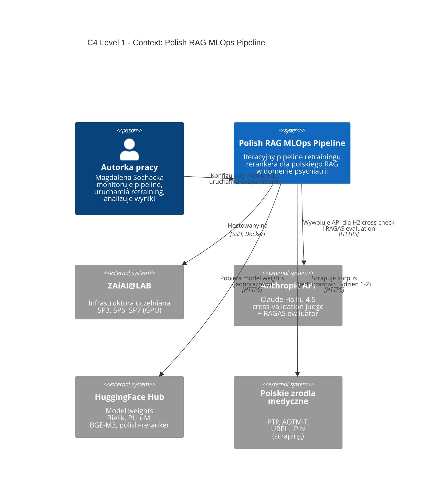
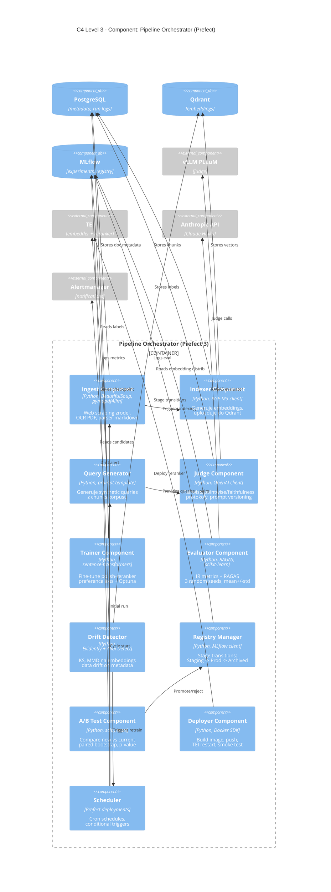
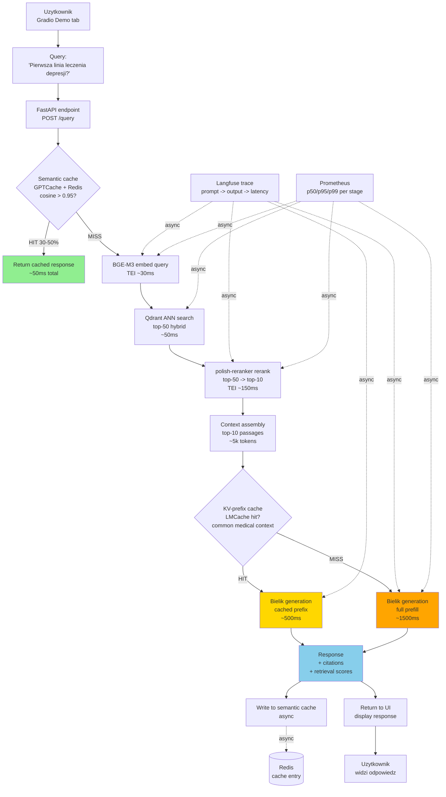
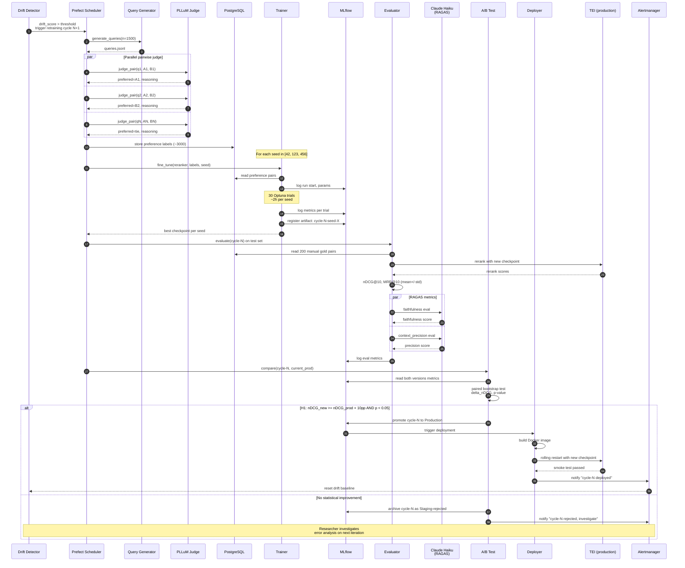

# Diagramy architektury — Pipeline MLOps RAG

**Praca inżynierska:** Pipeline MLOps do iteracyjnego retrainingu rerankera w polskojęzycznym RAG (psychiatria)
**Autorka:** Magdalena Sochacka, s25508, PJATK
**Data:** 07 maja 2026

---

## Spis diagramów

| # | Typ | Co pokazuje | Rozdział pracy |
|---|-----|------------|----------------|
| 1 | C4 Level 1 — Context | System w otoczeniu (użytkownicy, external systems) | Rozdz. 1, 5 |
| 2 | C4 Level 2 — Container | Wszystkie usługi i bazy w stacku | Rozdz. 5 |
| 3 | C4 Level 3 — Component | Komponenty wewnątrz Pipeline Orchestrator | Rozdz. 5 |
| 4 | Logical pipeline flow | Ogólny przepływ danych przez pipeline | Rozdz. 5 |
| 5 | Iterative retraining cycle | Sercowy loop MLOps — cykl retreningu | Rozdz. 5, 6 |
| 6 | Runtime inference flow | Ścieżka query użytkownika przez system | Rozdz. 5 |
| 7 | Sequence — retraining + A/B gating | Time-ordered interactions w cyklu retreningu | Rozdz. 5 |

**Renderowanie:**
- Lokalne: VS Code z extension "Markdown Preview Mermaid Support" (Matt Bierner)
- Online: mermaid.live (wklej kod, eksportuj PNG/SVG)
- W pracy: rendery PNG wstawiasz jako Figury 5.1 — 5.7

---

## Diagram 1. C4 Level 1 — Context

Pokazuje system w szerokim otoczeniu. Odpowiada na pytanie "kto i co wchodzi w interakcję z systemem".



**Opis:**
Pojedynczy "system" z perspektywy C4 — całość pipeline'u traktowana jako black box w tej skali. Cztery zewnętrzne systemy: ZAiAI@LAB (infrastruktura), Anthropic API (paid external evaluator), HuggingFace (model registry zewnętrzny), polskie źródła (data ingestion). Jeden user — autorka jako research operator.

---

## Diagram 2. C4 Level 2 — Container

Otwiera czarną skrzynkę z Diagramu 1. Pokazuje wszystkie kontenery (services, databases) i ich technologie.

```mermaid
C4Container
    title C4 Level 2 - Container: Polish RAG MLOps Pipeline

    Person(researcher, "Autorka", "Research operator")

    System_Boundary(rag_pipeline, "Polish RAG MLOps Pipeline") {
        Container(ui, "Gradio UI", "Python, Gradio", "3 zakladki:<br/>Demo, Compare, Annotate")
        Container(api, "API Layer", "Python, FastAPI", "Pipeline triggers,<br/>health checks,<br/>metrics export")
        Container(orchestrator, "Pipeline Orchestrator", "Python, Prefect 3", "DAG-i: ingest, generate,<br/>judge, train, eval,<br/>drift, deploy")

        ContainerDb(postgres, "PostgreSQL", "PostgreSQL 16", "Metadane corpusu,<br/>chunks, eval pairs,<br/>run logs, drift metrics")
        ContainerDb(qdrant, "Qdrant", "Rust, Apache 2.0", "BGE-M3 embeddings,<br/>hybrid retrieval,<br/>drift queries")
        ContainerDb(redis, "Redis Stack", "Redis + RedisJSON<br/>+ RediSearch", "Semantic cache (GPTCache)<br/>KV-prefix cache (LMCache)")
        ContainerDb(minio, "MinIO", "Go, S3-compatible", "Raw documents:<br/>PDF, HTML")

        Container(vllm_pllum, "vLLM - PLLuM", "Python, vLLM, GPU", "PLLuM-12B-instruct<br/>judge serving")
        Container(vllm_bielik, "vLLM - Bielik", "Python, vLLM, GPU", "Bielik 11B v3<br/>generation serving")
        Container(tei, "TEI", "Rust, HuggingFace", "BGE-M3 embedder<br/>+ polish-reranker")

        Container(mlflow, "MLflow", "Python", "Tracking + Model Registry<br/>A/B test gating")
        Container(langfuse, "Langfuse", "Node.js, self-hosted", "LLM-specific traces<br/>prompt versioning")

        Container(otel, "OTel Collector", "Go, vendor-neutral", "Metrics, logs, traces<br/>routing")
        ContainerDb(prometheus, "Prometheus", "Go, TSDB", "Metrics storage<br/>15 days retention")
        ContainerDb(loki, "Loki", "Go, TSDB", "Log aggregation")
        ContainerDb(tempo, "Tempo", "Go, traces", "Distributed tracing")
        Container(grafana, "Grafana", "Go, UI", "Dashboards, alerts<br/>single pane of glass")
        Container(alertmanager, "Alertmanager", "Go", "User notifications")

        Container(drift, "Drift Detector", "Python<br/>Evidently + Alibi Detect", "KS, MMD on embeddings<br/>data drift on metadata")
        Container(dvc, "DVC", "Python, CLI", "Dataset versioning<br/>raw + processed + eval")
    }

    System_Ext(anthropic, "Anthropic API", "Claude Haiku 4.5")
    System_Ext(huggingface, "HuggingFace Hub", "Model weights")

    Rel(researcher, ui, "Uses", "HTTPS")
    Rel(researcher, grafana, "Monitors", "HTTPS")

    Rel(ui, api, "REST", "HTTPS")
    Rel(api, orchestrator, "Triggers flows", "Prefect SDK")
    Rel(api, qdrant, "Retrieves", "gRPC")
    Rel(api, redis, "Cache check/write", "Redis protocol")
    Rel(api, vllm_bielik, "Generation", "OpenAI API")
    Rel(api, tei, "Embed + rerank", "REST")

    Rel(orchestrator, postgres, "Stores metadata", "psycopg")
    Rel(orchestrator, qdrant, "Indexes", "qdrant-client")
    Rel(orchestrator, vllm_pllum, "Judge calls", "OpenAI API")
    Rel(orchestrator, vllm_bielik, "Faithfulness eval", "OpenAI API")
    Rel(orchestrator, tei, "Train/inference", "REST")
    Rel(orchestrator, mlflow, "Logs experiments", "MLflow client")
    Rel(orchestrator, langfuse, "LLM traces", "Langfuse SDK")
    Rel(orchestrator, drift, "Drift checks", "Python")
    Rel(orchestrator, dvc, "Data versioning", "CLI")
    Rel(orchestrator, anthropic, "Cross-check + RAGAS", "HTTPS")

    Rel(orchestrator, otel, "Telemetry", "OTLP")
    Rel(api, otel, "Telemetry", "OTLP")
    Rel(otel, prometheus, "Metrics", "remote write")
    Rel(otel, loki, "Logs", "Loki API")
    Rel(otel, tempo, "Traces", "OTLP")

    Rel(grafana, prometheus, "Queries", "PromQL")
    Rel(grafana, loki, "Queries", "LogQL")
    Rel(grafana, tempo, "Queries", "TraceQL")
    Rel(grafana, alertmanager, "Forwards alerts", "REST")

    Rel(drift, alertmanager, "User notification", "REST")
    Rel(huggingface, vllm_pllum, "Model weights", "HTTPS")
    Rel(huggingface, vllm_bielik, "Model weights", "HTTPS")
    Rel(huggingface, tei, "Model weights", "HTTPS")
    Rel(dvc, minio, "Data backend", "S3 API")
```



**Opis:**
Wszystkie 17 kontenerów stacku z relacjami. Pokazuje gdzie co jest wdrażane (vLLM × 2 dla PLLuM i Bielika, TEI dla embedder i reranker), jak komunikacja przepływa (UI → API → Orchestrator → wszystko), i jak observability tworzy single pane of glass przez Grafana. Centralne miejsce zajmuje **Pipeline Orchestrator (Prefect)** który dyryguje wszystkim — to potwierdza wybór Prefect jako "core MLOps layer".

---

## Diagram 3. C4 Level 3 — Component (Pipeline Orchestrator zoom)

Otwiera czarną skrzynkę Pipeline Orchestrator z Diagramu 2. Pokazuje komponenty wewnętrzne — Prefect flows i ich strukturę.



**Opis:**
11 wewnętrznych komponentów Pipeline Orchestrator, każdy odpowiada konkretnemu Prefect flow. Pokazuje **modułową strukturę kodu** (mapuje 1:1 na strukturę repo z `dev_environment.docx`: `src/ingest/`, `src/indexer/`, `src/judge/`, ...). Scheduler jako master koordynator triggerujący wszystko. Drift detector ma podwójną rolę — alertuje user (przez Alertmanager) i triggeruje scheduler (Prefect-native trigger logic).

---

## Diagram 4. Logical pipeline flow

Linearny przepływ danych — co po czym się dzieje od raw documents do deployed reranker.

```mermaid
flowchart TD
    A[Raw documents<br/>PDF, HTML<br/>PTP, AOTMiT, URPL, IPiN] --> B[Ingest<br/>scraping, OCR, parsing]
    B --> C[Processed chunks<br/>markdown, 512+50 tokens]
    C --> D[Indexer<br/>BGE-M3 embedding]
    D --> E[(Qdrant<br/>corpus_chunks)]

    F[Queries<br/>real + synthetic 30/70] --> G[Embed query<br/>BGE-M3]
    G --> H[Retrieve top-50<br/>Qdrant ANN]
    E --> H
    H --> I[Random pairs A,B<br/>per query]
    I --> J[PLLuM-judge<br/>pairwise]
    J --> K[(PostgreSQL<br/>preference labels)]

    K --> L[Trainer<br/>polish-reranker<br/>fine-tune Optuna]
    L --> M[Checkpoint<br/>per cycle, per seed]
    M --> N[Evaluator<br/>nDCG, MRR + RAGAS]
    N --> O{nDCG@10<br/>>= baseline + 10pp<br/>p < 0.05?}

    O -->|Yes| P[MLflow Registry<br/>Staging -> Production]
    O -->|No| Q[Reject<br/>archive Staging]
    Q --> R[Investigate<br/>error analysis]

    P --> S[Build Docker<br/>+ TEI restart]
    S --> T[Production reranker<br/>traffic switch]
    T --> U[Drift Detector<br/>rolling window]
    U --> V{Drift<br/>detected?}
    V -->|Yes| W[Trigger<br/>retraining cycle N+1]
    V -->|No| X[Continue serving]
    W --> F

    style A fill:#e1f5ff
    style M fill:#fff4e1
    style P fill:#e1ffe1
    style T fill:#e1ffe1
    style W fill:#ffe1e1
```

**Opis:**
Główny logical flow z trzema obszarami:
- **Niebieski (góra)** — data ingestion (jednorazowy, na początku każdego cyklu)
- **Pomarańczowy (środek)** — training + evaluation (per cykl)
- **Zielony (dół)** — deployment (po passing A/B gate)
- **Czerwony (pętla)** — drift trigger (powrót do top, kolejny cykl)

Decision gate po evaluatorze (ja/nie passing baseline + threshold + statystyczna istotność) jest **CORE MLOps gate** który Kojałowicz lubi. Pokazuje że deployment NIE jest automatic — wymaga statystycznie istotnej poprawy.

---

## Diagram 5. Iterative retraining cycle (MLOps loop)

Sercowy diagram pracy. Pokazuje jak 3 cykle retreningu się składają i jak detect drift zamyka pętlę.

```mermaid
flowchart LR
    subgraph Init[Initial state]
        BASE[Base reranker<br/>polish-reranker-roberta-v3<br/>off-the-shelf]
    end

    subgraph C1[Cykl 1]
        Q1[Generate queries<br/>1000-2000] --> J1[PLLuM-judge<br/>pairwise labels]
        J1 --> T1[Train cycle-1<br/>3 seeds]
        T1 --> E1[Eval cycle-1<br/>vs base]
        E1 --> AB1{A/B<br/>wins?}
        AB1 -->|H1: nDCG +10pp| D1[Deploy cycle-1]
    end

    subgraph C2[Cykl 2]
        Q2[Fresh queries<br/>+ drift queries] --> J2[Judge cycle-2]
        J2 --> T2[Train cycle-2<br/>3 seeds]
        T2 --> E2[Eval vs cycle-1]
        E2 --> AB2{Wins?}
        AB2 -->|H3: still gain| D2[Deploy cycle-2]
    end

    subgraph C3[Cykl 3]
        Q3[Fresh queries] --> J3[Judge cycle-3]
        J3 --> T3[Train cycle-3<br/>3 seeds]
        T3 --> E3[Eval vs cycle-2]
        E3 --> AB3{Wins +<br/>delta > 2pp?}
        AB3 -->|H3: plateau| D3[Reject cycle-3<br/>stop iteration]
        AB3 -->|Unlikely: still wins| D3X[Deploy cycle-3]
    end

    subgraph Drift[Drift monitoring]
        DM[Embedding drift<br/>KS, MMD] --> DT{Drift<br/>detected?}
        DT -->|Yes, simulated| RT[Trigger<br/>retraining]
        DT -->|No| CS[Continue serving]
    end

    BASE --> Q1
    D1 --> Q2
    D2 --> Q3
    D3 --> DM
    D3X --> DM
    RT -.->|in production<br/>not in this thesis| Q1

    style BASE fill:#cccccc
    style D1 fill:#90EE90
    style D2 fill:#90EE90
    style D3 fill:#FFB347
    style D3X fill:#90EE90
    style RT fill:#FF6B6B
```



**Opis:**
Trzy cykle retreningu kaskadowo. Każdy startuje od deployed cycle z poprzedniego (lub od base dla cycle-1). H3 testuje plateau po cyklu 2 — diagram pokazuje OBA możliwe wyniki (plateau = D3 reject, lub niespodziewana kontynuacja = D3X deploy). Drift monitoring jako odrębny pętla — w pracy uruchamiany **simulated** (perturbed queries), w produkcji byłby na live traffic. Czerwona przerywana strzałka pokazuje pętlę continuous retraining która jest **future work** (nie scope tej pracy).

**Numeryczna interpretacja H1-H3 na diagramie:**
- H1 ≥10pp poprawa po cyklu 1 → AB1 zielona
- H2 jest validacją judge'a, nie cycle-specific
- H3 plateau po cyklu 2 → AB3 czerwona (reject) jako expected outcome

---

## Diagram 6. Runtime inference flow (RAG end-to-end)

Co się dzieje w czasie rzeczywistym gdy user wpisze query w Gradio Demo. Pokazuje cache layers i hot path.



**Opis:**
Trzy ścieżki latency w zależności od cache hits:
- **Best case (zielony)** — semantic cache hit ~50ms total (30-50% queries jeśli wzorce repeat)
- **Mid case (żółty)** — KV-prefix cache hit, generation skraca się do ~500ms (embedded common medical context)
- **Worst case (pomarańczowy)** — pełen pipeline ~2000ms (cold path)

Async branches do Langfuse i Prometheus — observability nie blokuje response path. To jest **production-grade RAG pattern** którego Kojałowicz oczekuje. Cache hit rate jest bonus metric w obserwowalności (rozdz. 7).

**Mapowanie na komponenty stacku:**
- TEI = warstwa 1 (BGE-M3 + polish-reranker) + warstwa 7 serving
- vLLM (Bielik) = warstwa 1 + warstwa 7 serving
- GPTCache + LMCache = warstwa 2 (Redis Stack)
- Langfuse + Prometheus = warstwa 5

---

## Diagram 7. Sequence diagram — retraining cycle z A/B gating

Pokazuje time-ordered interactions w jednym pełnym cyklu retreningu z deploymentem. Najgłębszy "deep dive" dla recenzenta który chce zrozumieć dokładny mechanizm.



**Opis:**
26 numerowanych interakcji pokazujących:

1. **Steps 1-2:** Drift detection triggeruje cycle (lub manual trigger przez researcher)
2. **Steps 3-4:** Query generation (asynchroniczne pętle, ale uproszczone)
3. **Steps 5-7:** Parallel pairwise judging — kluczowy bottleneck pipeline'u, async batched
4. **Steps 8-9:** Persistence labels do PostgreSQL
5. **Steps 10-15:** Training loop — 3 seeds, każdy z Optuna 30 trials, MLflow tracking
6. **Steps 16-19:** Evaluation z TEI (production-like inference path)
7. **Steps 20-22:** RAGAS metrics przez Claude Haiku (parallel, niezależne)
8. **Steps 23-24:** A/B test z paired bootstrap statistical significance
9. **Steps 25-26 (alt):** Promote-or-reject decision z deploymentem lub archiwizacją

**Defensywne argumenty dla Kojałowicza wbudowane w diagram:**
- 3 seeds (steps 13-15) — statystyczna stabilność
- Paired bootstrap (step 23) — proper statistical test, nie naive comparison
- Statistical gate H1 (step 25) — deployment NIE jest automatic na "lepsze średnie"
- RAGAS przez Claude Haiku (steps 20-22) — eliminuje circular reasoning z PLLuM-judge

---

## Mapowanie diagramów na rozdziały pracy

| Diagram | Rozdz. 1 | Rozdz. 2 | Rozdz. 3 | Rozdz. 4 | Rozdz. 5 | Rozdz. 6 | Rozdz. 7 | Rozdz. 8 |
|---------|---------|---------|---------|---------|---------|---------|---------|---------|
| 1. C4 Context | Figura motywacyjna | — | — | — | Tło architektury | — | — | — |
| 2. C4 Container | — | — | — | — | **Centralna figura** | — | — | — |
| 3. C4 Component | — | — | — | — | Detal Pipeline | — | — | — |
| 4. Logical pipeline flow | — | — | Data flow context | — | **Kluczowa figura** | — | — | — |
| 5. Iterative retraining | — | — | — | — | — | **Kluczowa figura** | Interpretacja H1/H3 | Future work pętla |
| 6. Runtime inference | — | — | — | — | RAG runtime | — | Cache hit rate | — |
| 7. Sequence diagram | — | — | — | — | A/B gating detail | Training procedure | Statistical significance | — |

**Wskazówka praktyczna:** Rozdz. 5 (Architektura) ma ~5 z 7 figur — to potwierdza że Kojałowicz słusznie pozycjonuje rozdz. 5 jako CENTRALNY rozdział pracy. Bez tych diagramów rozdział byłby pustą prozą.

---

## Instrukcje renderowania

### Opcja 1: VS Code (rekomendowane dla iteracji)
1. Install extension "Markdown Preview Mermaid Support" (Matt Bierner) w VS Code
2. Otwórz ten plik
3. Cmd/Ctrl + Shift + V → preview z renderowanymi diagramami
4. Right-click na diagram → Export to PNG

### Opcja 2: mermaid.live (dla pojedynczych eksportów)
1. Idź na https://mermaid.live
2. Skopiuj zawartość kodu mermaid (między ```mermaid a ```)
3. Wklej do edytora
4. Eksport → PNG / SVG / PDF

### Opcja 3: mermaid-cli lokalnie (dla batch)
```bash
npm install -g @mermaid-js/mermaid-cli
mmdc -i diagrams.md -o output/ -t neutral -b transparent
```

### Opcja 4: dla pracy magisterskiej
Eksportuj każdy diagram jako PNG (najlepiej 300 DPI dla druku), wstawiaj do Word/LaTeX jako Figury 5.1 — 5.7 z podpisami w stylu PJATK.
